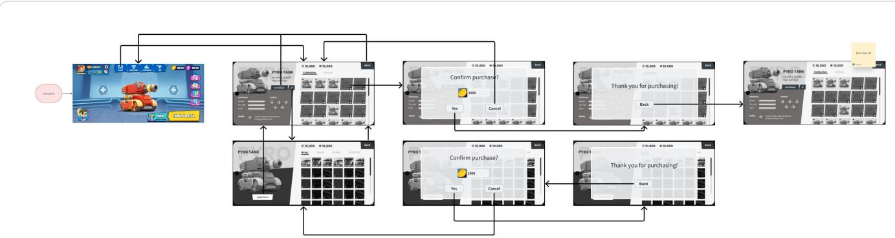
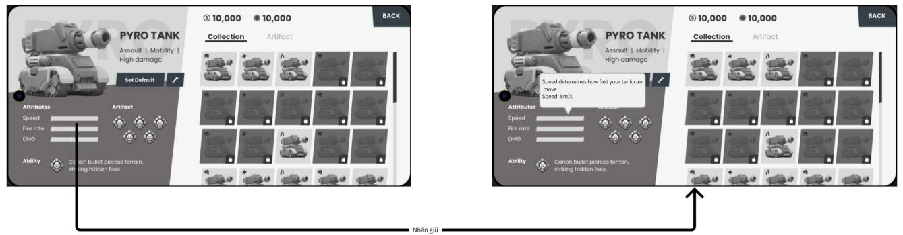

# [Asset, UI] [Tank War] Garage Design - UI/UX

THÔNG TIN THIẾT KẾ GIAO DIỆN GARAGE

Version: v1.1   
Người viết: phucth12   
Ngày tạo: 22 - 09 - 2025

<table><tr><td rowspan=1 colspan=1>Phienban</td><td rowspan=1 colspan=1>Ngay</td><td rowspan=1 colspan=1>Mo ta</td><td rowspan=1 colspan=1>Nguoi viet</td><td rowspan=1 colspan=1>Nguoireview</td><td rowspan=1 colspan=1>Duyet?</td></tr><tr><td rowspan=1 colspan=1>v1.0</td><td rowspan=1 colspan=1>26-09-2025</td><td rowspan=1 colspan=1>Hoan thanh file</td><td rowspan=1 colspan=1>P phucth12</td><td rowspan=1 colspan=1></td><td rowspan=1 colspan=1>□</td></tr><tr><td rowspan=1 colspan=1>v1.1</td><td rowspan=1 colspan=1>01-10-2025</td><td rowspan=1 colspan=1>Update Garage Userflow</td><td rowspan=1 colspan=1> phucth12 </td><td rowspan=1 colspan=1></td><td rowspan=1 colspan=1>□</td></tr></table>

# 1. Mục đích thiết kế

Xác định rõ ràng các thông tin cần trình bày và các cách tương tác với nó trong các màn hình Garage.

Đảm bảo thiết kế có những đặc điểm sau:

• Người chơi cảm thấy dễ hiểu và tiện lợi khi tương tác với Garage.   
• Người chơi có lựa chọn nghiên cứu kỹ trước khi bỏ tiền ra mua vật phẩm.   
• Những thông số nếu có phải định dạng rõ ràng.

# 2. Mục tiêu tài liệu

Tài liệu được dùng để giúp đội Art & Dev thiết kế UI Garage phù hợp.

Tham khảo tài liệu Garage chính: [Character Module] [Tank War] Garage Design - Main

Tham khảo tài liệu chức năng Garage: [Character Module] [Tank War] Garage Design - Functions

# 3. Tổng quan tài liệu

4. Giao diện Tank Garage

4.1 Danh sách Tanks & Artifacts Logic sort danh sách tank 4.2 Thông tin tank 4.3 Danh sách decor tank Thành phần trong Custom: Logic sort danh sách decor tank

# 5. Giao diện đặc biệt

5.1 Tham khảo chỉ số tank   
5.2 Mua decor (Normal + AI gen)

6. Future additions

7. Notes

# 4 . Giao diện Tank Garage

  
Garage Userflow

Note: Hiện tại AI gen decor đang ở version 1 nên áp dụng chức năng mua bán của decor bình thường

# 4.1 Danh sách Tanks & Artifacts

◦ Chứa 2 mục lớn là Tank & Artifact. ◦ Nằm bên phải màn hình ◦ Liệt kê tanks & artifacts cho player tương tác.

<table><tr><td rowspan=1 colspan=1>Tén thanhphan</td><td rowspan=1 colspan=1>Muc dich</td><td rowspan=1 colspan=1>Noi dung</td><td rowspan=1 colspan=1>Design Note</td></tr><tr><td rowspan=1 colspan=1>Tank bar</td><td rowspan=1 colspan=1> Hién thi danh sách Tank</td><td rowspan=1 colspan=1>Nhän vao thanh näy dé́ hién thi danhsāch TankTén dät la &quot;Collection&quot;</td><td rowspan=1 colspan=1>Mac dinh chonkhi bat dau vaoGarage</td></tr><tr><td rowspan=1 colspan=1>Artifact bar</td><td rowspan=1 colspan=1> Hien thi danh sāchArtifact</td><td rowspan=1 colspan=1>Nhän vao thanh nay dé hién thi danhsách Artifact</td><td rowspan=1 colspan=1></td></tr><tr><td rowspan=1 colspan=1>Icon Tank</td><td rowspan=1 colspan=1>Dai dien cho con Tanktrong danh sách</td><td rowspan=1 colspan=1>Bao gom:· Thumbnail tank： Class icon： Trang thäi chua mua (+ So tien cänunlock)</td><td rowspan=1 colspan=1>C6 theé xem xétdat trang thaichua mua lam xám di icon &amp;dat6khoa</td></tr><tr><td rowspan=1 colspan=1>Cac nut sort theoclass</td><td rowspan=1 colspan=1>Cho phép nguoi dungloc danh sách tank theoclass</td><td rowspan=1 colspan=1>Chi hién thi class tank dugc chon</td><td rowspan=1 colspan=1></td></tr><tr><td rowspan=1 colspan=1> teon Artifaet</td><td rowspan=1 colspan=1> Dai dien cho Artifact trong danh sach</td><td rowspan=1 colspan=1></td><td rowspan=1 colspan=1></td></tr></table>

Logic sort danh sách tank

▪ Đã sở hữu $>$ Chưa sở hữu Scout $>$ Assault $>$ Heavy $ >$ Elemental)   
▪ Gold $>$ Diamond   
▪ Rẻ > Mắc

# 4.2 Thông tin tank

◦ Nằm bên trái màn hình ◦ Hiển thị các nội dung cơ bản của tank

<table><tr><td colspan="1" rowspan="1">Tén thänhphän</td><td colspan="1" rowspan="1">Muc dich</td><td colspan="1" rowspan="1">Noi dung</td><td colspan="1" rowspan="1"> Design Note</td></tr><tr><td colspan="1" rowspan="1"></td><td colspan="1" rowspan="1"></td><td colspan="1" rowspan="1"></td><td colspan="1" rowspan="1"></td></tr><tr><td colspan="1" rowspan="1">Tank title</td><td colspan="1" rowspan="1"> Hién thi tieu diem cuatank</td><td colspan="1" rowspan="1">Bao gom:· Ten tank·Tua cua tank (3 däc diem chinh cuatank）</td><td colspan="1" rowspan="1">Neu can thithong tin naysenam8file*dienfilevaoday</td></tr><tr><td colspan="1" rowspan="1">Tank stats</td><td colspan="1" rowspan="1"> Hien thi thong so cuatank</td><td colspan="1" rowspan="1">Bao gom:·HP· Tcdo· Tócbän· Satthuong Trinh bay tung thong sö bang 1"progress bar". Tuy vao chi socua tank ma sé dugc danh gia: Weak| Average |Good | Strong Note: Phān dānh giâ phu thu@c vao khoang chi sδ dugc xac dinh san. Sau khichot thóng sö chinh xāc thisé xac dinh.</td><td colspan="1" rowspan="1"></td></tr><tr><td colspan="1" rowspan="1">Skill</td><td colspan="1" rowspan="1">Hien thi thong tin ve ky nang cua tank</td><td colspan="1" rowspan="1">Bao gom:· Icon cua ky näng·Doan van ngan mieu ta ky nang</td><td colspan="1" rowspan="1"> Tham khaoskills:画[Combat Module][TankWar] Tank Skill</td></tr><tr><td colspan="1" rowspan="1">Nut dattankmacdinh</td><td colspan="1" rowspan="1">Chon tank chinh déhien thi ngoai Home</td><td colspan="1" rowspan="1">Ten la "Set default"</td><td colspan="1" rowspan="1"></td></tr><tr><td colspan="1" rowspan="1">Nut decor</td><td colspan="1" rowspan="1">Chuyen tiep player ti giao dien Tank Decorcua Garage</td><td colspan="1" rowspan="1"></td><td colspan="1" rowspan="1">C6 the xem xetdat ky hieu laspray can么</td></tr><tr><td colspan="1" rowspan="1"> Artifacts</td><td colspan="1" rowspan="1"></td><td colspan="1" rowspan="1"></td><td colspan="1" rowspan="1"></td></tr><tr><td>equip</td><td>Hién thi danh sách artifact(s) player dang</td><td></td><td>Khi define xong sé dudc</td></tr></table>

# 4.3 Danh sách decor tank

◦ Có 4 mục là Wrap, Decal, Sticker và Custom.   
◦ Nằm bên phải màn hình   
◦ Liệt kê các decor cho player chọn dùng.   
◦ Access phần này dùng nút decor ở giao diện Tank Garage.

<table><tr><td rowspan=1 colspan=1>Ten thanh phan</td><td rowspan=1 colspan=1>Muc dich</td><td rowspan=1 colspan=1>Noi dung</td><td rowspan=1 colspan=1> Design Note</td></tr><tr><td rowspan=1 colspan=1>Wrap bar</td><td rowspan=1 colspan=1> Hién thi danh sách wrap</td><td rowspan=1 colspan=1> Nhän vao thanh nay dé hién thi danhsách wrapTén dät la &quot;Wrap&quot;</td><td rowspan=1 colspan=1>Mac dinh chonkhi bat dau vaoGarage</td></tr><tr><td rowspan=1 colspan=1>Decal bar</td><td rowspan=1 colspan=1> Hien thidanh sächArtifact</td><td rowspan=1 colspan=1>Nhän vao thanh nay dé́ hién thi danhsäch decalTen dät la &quot;Decal&quot;</td><td rowspan=1 colspan=1></td></tr><tr><td rowspan=1 colspan=1> Sticker bar</td><td rowspan=1 colspan=1> Hien thi danh sächArtifact</td><td rowspan=1 colspan=1> Nhän vao thanh nay dé hién thi danhsach decalTen dät la &quot;Sticker&quot;</td><td rowspan=1 colspan=1></td></tr><tr><td rowspan=1 colspan=1>Custom bar</td><td rowspan=1 colspan=1> Hién thi cac danh sáchdecor dugc gen boi Alcho player</td><td rowspan=1 colspan=1>Nhän vao thanh nay dé hién thi danhsách wrap va sticker dugc gen böi Al.Note: Phän decal sé dugc thém vaosau.Tén dät la &quot;Custom&quot;</td><td rowspan=1 colspan=1></td></tr><tr><td rowspan=1 colspan=1>Icon Tank</td><td rowspan=1 colspan=1> Hinh dai dien cho conTank trong danh säch</td><td rowspan=1 colspan=1>Bao gom:：Thumbnail tank：  Trang thäi chua mua (+ Só tien cänunlock)</td><td rowspan=1 colspan=1>C6 thé xem xétdat trang thaichua mua lam xam di icon &amp;dat6khoa</td></tr><tr><td rowspan=1 colspan=1>Cac nutsort theoclass</td><td rowspan=1 colspan=1> Cho phép nguδi dungloc danh säch tank theoclass</td><td rowspan=1 colspan=1>Chi hién thi class tank dugc chon</td><td rowspan=1 colspan=1></td></tr></table>

Thành phần trong Custom:

Đây những thành phần riêng thuộc mục Custom.

Player chỉ thấy khi vào mục này.

<table><tr><td rowspan=1 colspan=1>Tén thanhphan</td><td rowspan=1 colspan=1> Muc dich</td><td rowspan=1 colspan=1>Noi dung</td><td rowspan=1 colspan=1>Design Note</td></tr><tr><td rowspan=1 colspan=1>Optiondecor</td><td rowspan=1 colspan=1>Hien thicac lua chondecor</td><td rowspan=1 colspan=1>·Liet ké các nut options. Hién tai chicó: Wrap &amp; Sticker.·  Khi nhän vao 1 trong cac nut, séhien thi danh sach tuong ung.Ten dät la &quot;Wrap&quot;</td><td rowspan=1 colspan=1> Mac dinh chonkhi bat dau vaoGarage</td></tr><tr><td rowspan=1 colspan=1>Danh sachwrap</td><td rowspan=1 colspan=1>Liet ké cac icon wrap dugc Al gen cho playersudung</td><td rowspan=1 colspan=1>Liet ké các icon wrap dugc Al gen choplayer su dung. Giäu cho dén khi player nhän nutwrap</td><td rowspan=1 colspan=1></td></tr><tr><td rowspan=1 colspan=1>Danh sachsticker</td><td rowspan=1 colspan=1>Liet ké cac icon stickerdu@c Al gen cho playersudung</td><td rowspan=1 colspan=1>Liét ké các icon wrap dugc Al gen cho player su dung. Giäu cho den khi player nhän nutsticker</td><td rowspan=1 colspan=1></td></tr><tr><td rowspan=1 colspan=1>Icon decor</td><td rowspan=1 colspan=1> Hinh dai dien cho decortrong danh sách</td><td rowspan=1 colspan=1>Bao gom:：Thumbnail decor：Trang thai chua mua (+ Só tien cänunlock)Note: Vichua äp dung Version 2, nén tam cho phép icon mua duqc.Sau nay icon sé free, nhung tinh phi sólan gen.</td><td rowspan=1 colspan=1>C6 thé xem xétdat trang thaichua mua lam xam di icon &amp;dat6khoa</td></tr><tr><td rowspan=1 colspan=1>Cac nut sort theoclass</td><td rowspan=1 colspan=1>Cho phép nguαi dungloc danh säch tank theoclass</td><td rowspan=1 colspan=1>Chi hien thi class tank du@c chon</td><td rowspan=1 colspan=1></td></tr></table>

Logic sort danh sách decor tank ▪ Đã sở hữu $>$ Chưa sở hữu ▪ Gold $>$ Diamond ▪ Rẻ > Mắc

# 5. Giao diện đặc biệt

# 5.1 Tham khảo chỉ số tank

  
Kiểm tra thông tin tank

<table><tr><td rowspan=1 colspan=1>Tén thanhphan</td><td rowspan=1 colspan=1> Muc dich</td><td rowspan=1 colspan=1>Noi dung</td><td rowspan=1 colspan=1>Design Note</td></tr><tr><td rowspan=1 colspan=1>Info box</td><td rowspan=1 colspan=1> Hién thi chi so cua tank</td><td rowspan=1 colspan=1>Hóp thöng tin nay chi hien thi sau khinhän giu vao 1 trong các thong sóNoi dung:：Ten chi so： Muc dich cua chi só (vd: Speedindicates how fast you can drive)</td><td rowspan=1 colspan=1>Mau chi só cóthe trung voimau cua thanhdanh giaNhän vao batky vi tri ngoaibox sé dongbox</td></tr><tr><td rowspan=1 colspan=1> Skill box</td><td rowspan=1 colspan=1>Hien thi chi so chinh xáccua ky näng cua tank</td><td rowspan=1 colspan=1>Hop thöng tin nay chi hien thi sau khinhän giu vao ky näng.Noi dung:：Ten ky nang Nhung chi sö lien quan (vd: Hooksé cän trinh bay các chi só: Do daihook, Sat thuong, CD,ammo box)</td><td rowspan=1 colspan=1>Nhän vao bätky vi tri ngoaibox se dongbox</td></tr></table>

# 5.2 Mua decor (Normal $+$ AI gen)

<table><tr><td rowspan=1 colspan=1>Tén thanhphan</td><td rowspan=1 colspan=1> Muc dich</td><td rowspan=1 colspan=1>Noi dung</td><td rowspan=1 colspan=1> Design Note</td></tr><tr><td rowspan=1 colspan=1>Confirmation box</td><td rowspan=1 colspan=1> Xác nhän mua icon</td><td rowspan=1 colspan=1> Hién thi khi player nhän vao icon decorchua s8 huu.Bao gom:·  Cau hoi xác nhän muaNutdongy：Nut cancel Noi dung xac nhän mua có dinh dang: &quot;Do you want to spend *so tien*.*icon tien te* to get this*wrap/decal/sticker*?&quot;</td><td rowspan=1 colspan=1></td></tr><tr><td rowspan=1 colspan=1>Alert box</td><td rowspan=1 colspan=1>Thong bao player khöng du tien deémuadecor</td><td rowspan=1 colspan=1> Hop thóng tin nay chi hien thi sau khi xác nhän mua decor ma player ko códutien.Noi dung:Thong bao khong du tien.·Nut quay lai. (Dua nguoi choiveTank Decor Screen)</td><td rowspan=1 colspan=1></td></tr></table>

Note: Version 1 áp dụng cùng 1 loại UI và chức năng.

# 6. Future additions

Cập nhật sang Version 2 (AI gen decors sẽ prompt được và dùng tokens - mua được $=$ diamonds?)

# 7. Notes

$=$ cach gi Hoi, trinh bay thanh stats $=$ high, mid,low? 26/9 hoi anh Q

Khi chọn mode xong, người chơi lập tức quay về màn hình chính với thông tin mode mới cập nhật bên cạnh nút Mode

• Tương tác giao diện:

◦ Vào giao diện qua nút "Garage" trên đầu màn hình   
◦ Liệt kê danh sách tank ở bên phải, tank không sở hữu sẽ bị khoá, và artifacts. ◦ Thông số của tank ở bên trái, có thể xem số chính xác $=$ cách nhấn giữ thông số. ◦ Để hiển thị tank mình muốn ngoài "Home", chọn tank & nhấn "Set Default". Player sẽ quay về "Home" với con tank đó.   
◦ Nhấn vào icon của chìa vặn đai ốc sẽ đưa người chơi tới 1 giao diện mới: 4 mục: Wrap, Decal, Sticker, Custom. Phần Custom là nơi player có thể tự tạo wrap, decal hay sticker dùng AI Gen.   
Những mục chưa mua - mở - bị khoá kèm theo điều kiện mở của nó (vàng hay gems) Nhấn vào mục decor hợp lệ sẽ thay đổi model của tank in real-time.   
Chọn trang trí mình muốn và nhấn "Apply Decor" bên trái dưới model tank để thay đổi trang trí và quay về giao diện thông số tank.

▪ Trong mục custom:

Mở ra, player phải chọn 1 trong 3 options: Wrap, Decal, Sticker, và/hoặc chọn theme có sẵn trước khi cho phép điền vào "Prompt".   
• Có gắn số lượng tiền tệ đặt biệt yêu cầu để gen. Hiện ra 1 vài bản và cho player chọn thử.   
• (Nếu player vô tình quay lại giao diện đầu trước khi chọn 1 decor phù hợp, hiện thong bao hoila "ban chäcchän la quay lai ko?ban sébo luot prompt nay!")   
Khi chọn apply decor, player được đưa về lại giao diện ban đầu