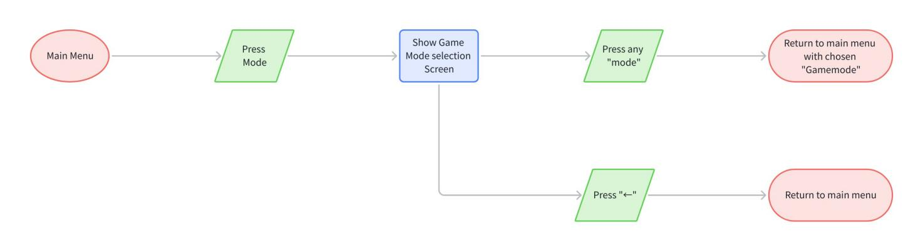

# [Asset, UI] [Tank War] Mode Selection Design

THÔNG TIN THIẾT KẾ CHỌN MODE CHƠI

Version: v1.1   
Người viết: phucth12   
Ngày tạo: 15 - 08 - 2025

<table><tr><td rowspan=1 colspan=1>Phienban</td><td rowspan=1 colspan=1>Ngay</td><td rowspan=1 colspan=1>Mota</td><td rowspan=1 colspan=1>Ngudi viet</td><td rowspan=1 colspan=1>Nguoireview</td><td rowspan=1 colspan=1>Duyét?</td></tr><tr><td rowspan=1 colspan=1>v1.0</td><td rowspan=1 colspan=1>30-07-2025</td><td rowspan=1 colspan=1> Hoan thanh file</td><td rowspan=1 colspan=1>Pphucth12 &amp;1 thanhdv2</td><td rowspan=1 colspan=1></td><td rowspan=1 colspan=1>□</td></tr><tr><td rowspan=1 colspan=1>v1.1</td><td rowspan=1 colspan=1>17-09-2025</td><td rowspan=1 colspan=1>Format lai file</td><td rowspan=1 colspan=1>P phucth12 </td><td rowspan=1 colspan=1></td><td rowspan=1 colspan=1>□</td></tr></table>

# 1. Mục đích thiết kế

Phân định rõ ràng các thông tin cần trình bày và các cách tương tác với nó trong màn hình chính của trận đấu.

Đảm bảo thiết kế có những đặc điểm sau:

• Người chơi cảm thấy dễ hiểu và tiện lợi khi chọn mode chơi.   
• Những thông số nếu có phải định dạng rõ ràng.

# 2. Mục tiêu tài liệu

Tài liệu được dùng để giúp đội Art & Dev thiết kế thông tin phù hợp.

3. Tổng quan tài liệu

4. Thành phần   
5. Userflow   
6. Notes

# 4. Thành phần

<table><tr><td rowspan=1 colspan=1>Tén thänhphan</td><td rowspan=1 colspan=1> Muc dich</td><td rowspan=1 colspan=1>Cach tuong täc</td><td rowspan=1 colspan=1>Design Note</td></tr><tr><td rowspan=1 colspan=1>Back button</td><td rowspan=1 colspan=1>Cho phép nguαi choiquay lai main menu</td><td rowspan=1 colspan=1> Nhän vao nut dé quay lai main menu</td><td rowspan=1 colspan=1></td></tr><tr><td rowspan=1 colspan=1>Danh sachgamemodes</td><td rowspan=1 colspan=1>Cho nguoi chdi chonmode choi</td><td rowspan=1 colspan=1>Nhän khung mode choi mong muön sédän vé lai main menu va cäp nhät téngamemode dä chon bén canh</td><td rowspan=1 colspan=1>Tham khao cáchBrawl Stars chophép nguoi chdithay doi mode dehinh dung rδ hon</td></tr></table>

# 5. Userflow

# 6. Notes

Khi chọn mode xong, người chơi lập tức quay về màn hình chính với thông tin mode mới cập nhật bên cạnh nút Mode