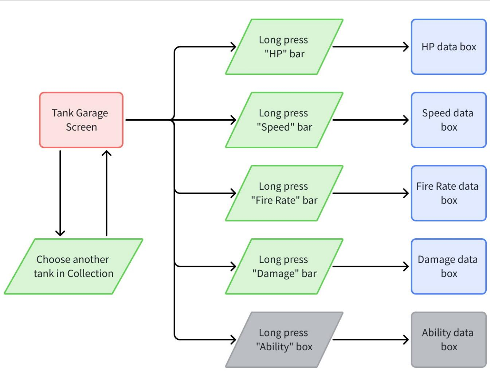
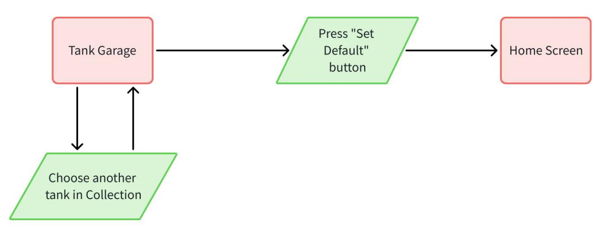
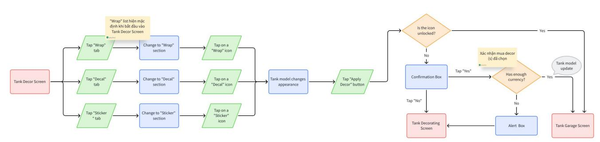
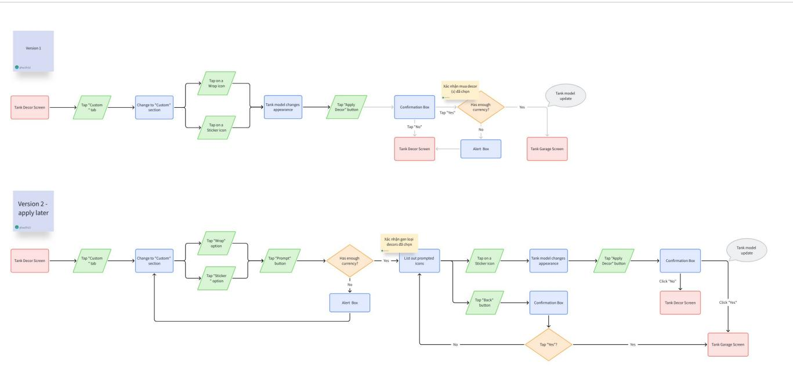

# [Character Module] [Tank War] Garage Design - Functions

THÔNG TIN THIẾT KẾ CHỨC NĂNG GARAGE

Version: v1.0   
Người viết: phucth12   
Ngày tạo: 22 - 09 - 2025

<table><tr><td rowspan=1 colspan=1>Phienban</td><td rowspan=1 colspan=1>Ngay</td><td rowspan=1 colspan=1>Mota</td><td rowspan=1 colspan=1>Ngudi viet</td><td rowspan=1 colspan=1>Nguoireview</td><td rowspan=1 colspan=1>Duyét?</td></tr><tr><td rowspan=1 colspan=1>v1.0</td><td rowspan=1 colspan=1>25-09-2025</td><td rowspan=1 colspan=1>Hoan thanh file</td><td rowspan=1 colspan=1>P phucth12</td><td rowspan=1 colspan=1></td><td rowspan=1 colspan=1>□</td></tr></table>

# 1. Mục đích thiết kế

Thiết kế tính năng đầy đủ chức năng và tiện lợi để player cảm thấy thoải mái và hấp dẫn đủ để dành thời gian sưu tầm tanks, skins & artifacts.

Đảm bảo thiết kế có những đặc điểm sau:

• Tương tác giữa các nút phải rõ ràng.   
• Player có thể hiểu thông tin được trình bày 1 cách trực quan.   
• Thuận lợi cho player.

# 2. Mục tiêu tài liệu

Tài liệu được dùng để giúp đội Art & Dev thiết kế chức năng Garage hợp lý.

Tham khảo tài liệu Garage chính: [Character Module] [Tank War] Garage Design - Main (Đang làm)

3. Tổng quan tài liệu

4. Tham khảo chỉ số Tank

4.1 Thành phần liên quan   
4.2 Mô tả chức năng

5. Thay đổi Tank ngoài Home

5.1 Thành phần liên quan   
5.2 Mô tả chức năng

6. Thay dổi diện mạo của tank (bình thường)

6.1 Thành phần liên quan 6.2 Mô tả chức năng Chọn xem trước wrap/decal/sticker Xác nhận thay đổi decor

7. Thay dổi diện mạo của tank (AI gen - ver 1)

7.1 Thành phần liên quan 7.2 Mô tả chức năng Chọn xem trước wrap/decal/sticker Xác nhận thay đổi decor

8. Bổ sung tương lai

9. Note

# 4. Tham khảo chỉ số Tank

# 4.1 Thành phần liên quan

<table><tr><td>Thänh phän</td><td>Mieu ta</td></tr><tr><td>Danh säch tank</td><td>Liét ké icon cua moi tank dä va chua so huu</td></tr><tr><td rowspan="5">Thöng tin tank</td><td>Bao gom:</td></tr><tr><td>Model 3D .</td></tr><tr><td>Tén &amp; diem noi bät</td></tr><tr><td>Thong só</td></tr><tr><td>Artifact .</td></tr></table>

# 4.2 Mô tả chức năng

  
Checking tank's stats

◦ Player cần nhấn giữ 0.5s để hiện chỉ số chi tiết của tank.

◦ Chỉ số hiện trên trong bảng với các tính chất sau:

Nhấn vào bất kỳ vị trí ngoài bảng chỉ đóng bảng.

▪ Chứa: • Giải thích cơ bản mục đích của chỉ số. • Chỉ số chính xác theo dạng số.

▪ Chỉ số tương ứng với tank được chọn.

Note: Nội dung giải thích sẽ nằm ở đây: [Asset, UI] [Tank War] Garage Design - UI/UX (Đang làm)

# 5. Thay đổi Tank ngoài Home

# 5.1 Thành phần liên quan

<table><tr><td rowspan=1 colspan=1>Thänh phän</td><td rowspan=1 colspan=1>Mieu ta</td></tr><tr><td rowspan=1 colspan=1>Danh säch tank</td><td rowspan=1 colspan=1>Liét ké icon cua moi tank dä vachua s8 huu</td></tr><tr><td rowspan=1 colspan=1>Nut &quot;Set Default&quot;</td><td rowspan=1 colspan=1>Nut thuc hién chuc näng</td></tr></table>

# 5.2 Mô tả chức năng

  
Setting a default tank

◦ Khi nhấn nút, player sẽ được đưa về Home. Model 3D tank trưng bày được chuyển sang tank được chọn trong Garage.   
◦ Nếu trong cùng party, player khác trong party sẽ thấy tank trưng bày thay đổi trong thời gian thực.

# 6. Thay dổi diện mạo của tank (bình thường)

6.1 Thành phần liên quan   

<table><tr><td>Thänh phän</td><td>Mieu ta</td></tr><tr><td>Danh sách wrap</td><td></td></tr><tr><td colspan="1" rowspan="1"></td><td colspan="1" rowspan="1">Liét ké icon cua moi wrap maplayer dä vä chua so huu</td></tr><tr><td colspan="1" rowspan="1">Danh sách decal</td><td colspan="1" rowspan="1">Liét ké icon cua moi decal maplayer dä va chua so huu</td></tr><tr><td colspan="1" rowspan="1">Danh säch sticker</td><td colspan="1" rowspan="1">Liét ké icon cua moi sticker maplayer dä vä chua só huu</td></tr><tr><td colspan="1" rowspan="1">Gold</td><td colspan="1" rowspan="1">Don vi tien té thong thuong</td></tr><tr><td colspan="1" rowspan="1">Diamond</td><td colspan="1" rowspan="1">Don vi tien té cao cap</td></tr><tr><td colspan="1" rowspan="1">Nut "Apply Decor"</td><td colspan="1" rowspan="1">Nut thuc hién chuc näng ápdung dién mao dä chon lén tank</td></tr></table>

# 6.2 Mô tả chức năng

  
Changing tank's appearance (Normal)

# Chọn xem trước wrap/decal/sticker

◦ Khi nhấn icon, model 3D tank sẽ áp dụng decor tương ứng. Note:

Không được chọn nhiều wrap cùng 1 lúc, chỉ 1 wrap. Check in về vị trí của decal & sticker. Hỏi coi nó có thể áp dụng nhiều cái cùng 1 lucko (vitrikhac nhau) ▪ Khi thay đổi sang tab khác, decor đang chọn xem vẫn được áp dụng.

◦ Nếu trong cùng party, player khác trong party sẽ không thấy tank trưng bày thay đổi trong thời gian thực.

# Xác nhận thay đổi decor

◦ Trường hợp chọn decor đã sở hữu:

Nhấn nút "Apply Decor" sẽ áp dụng decor lên tank và chuyển hướng player về Home. ▪ Nếu trong cùng party, tank được thay đổi trùng với tank được trưng bày ngoài Home $= >$ Player khác trong party sẽ thấy tank trưng bày thay đổi trong thời gian thực.

◦ Trường hợp chọn decor chưa sở hữu:

▪ Nhấn nút "Apply Decor" sẽ hiện bảng xác nhận mua icon: Bảng xác nhận chứa tổng tài nguyên cần tiêu để mua decor. Khi xác nhận mua, nếu không đủ tiền, hiện ra thông báo player chưa đủ tài nguyên để mua. Hiện thêm bảng hỏi là muốn qua shop mua tiền tệ không. • Hỏi xem là sẽ có decor không thể mua được = tiền tệ ko? Nếu có thì cần xét thém 1 bang thongbao khac. • Thực hiện giao dịch thành công chuyển player về trang Tank Decor với model 3D được áp dụng decor mới.

▪ Nếu trong cùng party, tank được thay đổi trùng với tank được trưng bày ngoài Home $= >$ Player khác trong party sẽ thấy tank trưng bày thay đổi trong thời gian thực.

# 7. Thay dổi diện mạo của tank (AI gen - ver 1)

7.1 Thành phần liên quan   

<table><tr><td rowspan=1 colspan=1>Thänh phän</td><td rowspan=1 colspan=1>Mieu ta</td></tr><tr><td rowspan=1 colspan=1>Danh säch wrap (Gen sän)</td><td rowspan=1 colspan=1>Liét ké icon cua moi wrap maplayer dä vä chua só huu</td></tr><tr><td rowspan=1 colspan=1>Danh sách sticker (Gen sän)</td><td rowspan=1 colspan=1>Liét ké icon cua moi sticker maplayer dä vä chua sö huu</td></tr><tr><td rowspan=1 colspan=1>Gold</td><td rowspan=1 colspan=1>Don vi tien té thong thuong</td></tr><tr><td rowspan=1 colspan=1>Diamond</td><td rowspan=1 colspan=1>Don vi tien té cao cap</td></tr><tr><td rowspan=1 colspan=1>Nut &quot;Apply Decor&quot;</td><td rowspan=1 colspan=1>Nut thuc hién chuc näng ápdung dién mao dä chon lén tank</td></tr></table>

# 7.2 Mô tả chức năng

  
Changing tank's appearance (Normal)

# Chọn xem trước wrap/decal/sticker

◦ Khi nhấn icon, model 3D tank sẽ áp dụng decor tương ứng. Note:

Không được chọn nhiều wrap cùng 1 lúc, chỉ 1 wrap. ▪ Check in về vị trí của decal & sticker. Hỏi coi nó có thể áp dụng nhiều cái cùng 1 luc ko (vi tri khac nhau) ▪ Tất cả các icon này hiện tại sẽ được gen sẵn.

◦ Nếu trong cùng party, player khác trong party sẽ không thấy tank trưng bày thay đổi trong thời gian thực.

# Xác nhận thay đổi decor

◦ Trường hợp chọn decor đã sở hữu:

▪ Nhấn nút "Apply Decor" sẽ áp dụng decor lên tank và chuyển hướng player về Home. ▪ Nếu trong cùng party, tank được thay đổi trùng với tank được trưng bày ngoài Home $= >$ Player khác trong party sẽ thấy tank trưng bày thay đổi trong thời gian thực.

◦ Trường hợp chọn decor chưa sở hữu:

▪ Nhấn nút "Apply Decor" sẽ hiện bảng xác nhận mua icon: • Bảng xác nhận chứa tổng tài nguyên cần tiêu để mua decor. • Khi xác nhận mua, nếu không đủ tiền, hiện ra thông báo player chưa đủ tài nguyên để mua. Hiện thêm bảng hỏi là muốn qua shop mua tiền tệ không.

• Hỏi xem là sẽ có decor không thể mua được = tiền tệ ko? Nếu có thì cần xét thém 1 bang thong bao khac.

• Thực hiện giao dịch thành công chuyển player về trang Tank Decor với model 3D được áp dụng decor mới.

▪ Nếu trong cùng party, tank được thay đổi trùng với tank được trưng bày ngoài Home $= >$ Player khác trong party sẽ thấy tank trưng bày thay đổi trong thời gian thực.

# 8. Bổ sung tương lai

• Cho phép người chơi tự gen decor - Thay đổi decor Version 2.

• Cho phép người chơi xài decal gen bởi AI.

# 9. Note

Doc cha chứa userflow cách đi vào/tương tác các elements/functions Doc con tả chi tiết các elements chứa gì và chứa ntn, functions hoạt động ntn(?)