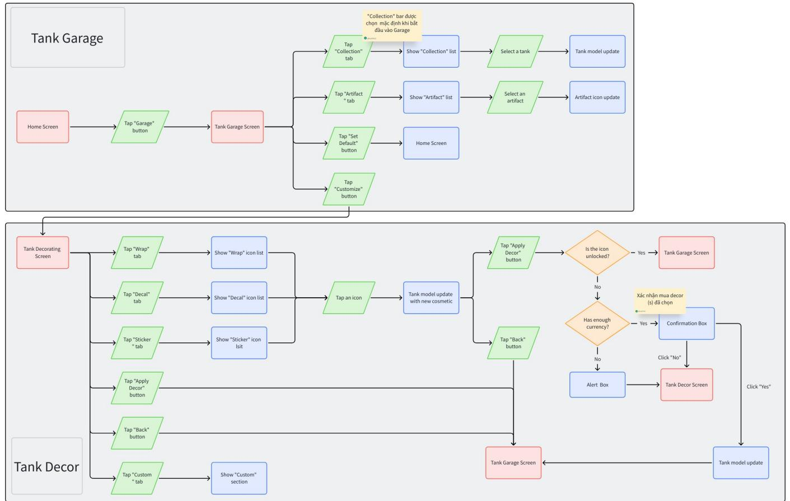
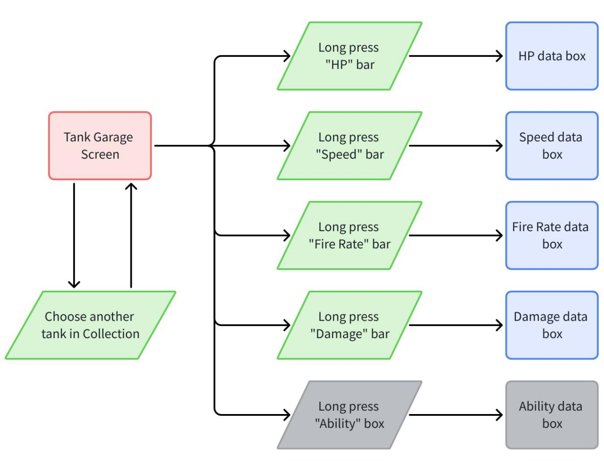
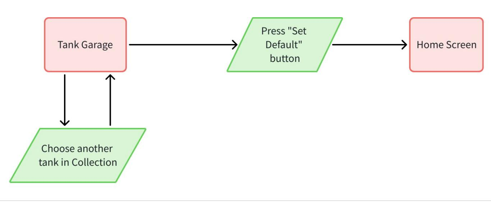
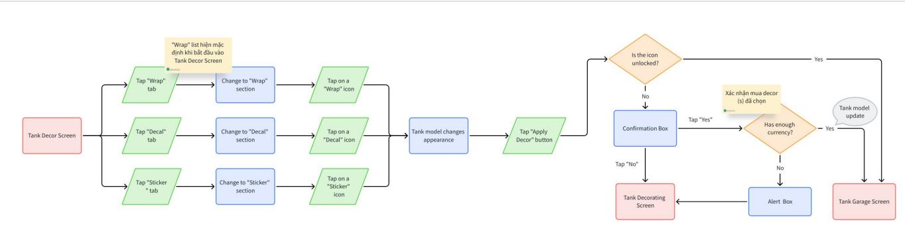
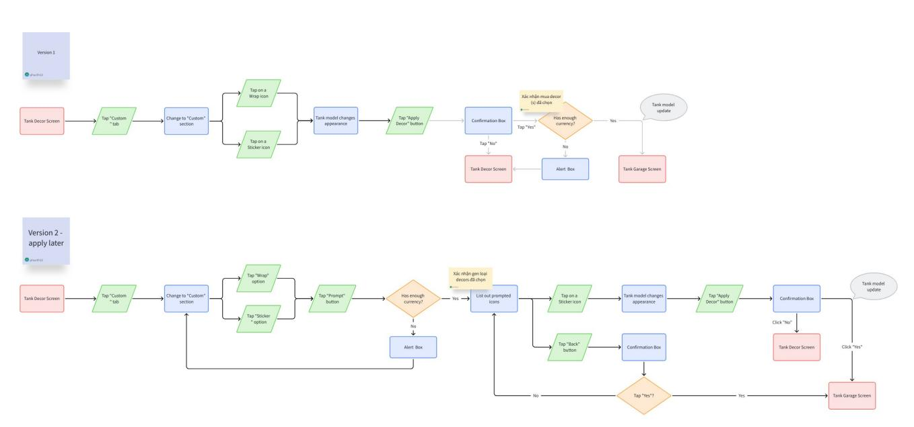

# [Character Module] [Tank War] Garage Design - Main

THÔNG TIN THIẾT KẾ GARAGE

Version: v1.0   
Người viết: phucth12   
Ngày tạo: 22 - 09 - 2025

<table><tr><td rowspan=1 colspan=1>Phienban</td><td rowspan=1 colspan=1>Ngay</td><td rowspan=1 colspan=1>Mota</td><td rowspan=1 colspan=1>Nguoi viet</td><td rowspan=1 colspan=1>Nguoireview</td><td rowspan=1 colspan=1>Duyét?</td></tr><tr><td rowspan=1 colspan=1>v0.0</td><td rowspan=1 colspan=1>24-09-2025</td><td rowspan=1 colspan=1>Hoan thanh file</td><td rowspan=1 colspan=1>P phucth12</td><td rowspan=1 colspan=1></td><td rowspan=1 colspan=1>□</td></tr></table>

# 1. Mục đích thiết kế

Thiết kế tổng quát và đầy đủ các yếu tố & chức năng cần trình bày và các cách tương tác với các thành phần đấy trong màn hình garage.

Đảm bảo thiết kế có những đặc điểm sau:

• Player thấy dễ hiểu và tiện lợi khi chọn/xem thông số tank khác và chỉnh sửa diện mạo của tank.   
• Player có lựa chọn xem kỹ các thông số tank.   
• Những thông số (nếu có) phải định dạng rõ ràng.

# 2. Mục tiêu tài liệu

Tài liệu được dùng để giúp đội Art & Dev thiết kế chức năng Garage hợp lý.

Tham khảo tài liệu chức năng chi tiết của Garage: [Character Module] [Tank War] Garage Design - Functions

Tham khảo tài liệu UI/UX của Garage: [Asset, UI] [Tank War] Garage Design - UI/UX

# 3. Tổng quan tài liệu

4. Giao diện

4.1 Tank Garage   
4.2 Tank Decor - Trang trí Tank

5. Chức năng

5.1 Tham khảo chỉ số tank   
5.2 Thay đổi tank ngoài Home   
5.3 Thay dổi diện mạo của tank (bình thường)   
5.4 Thay dổi diện mạo của tank (AI gen)

6. Cập nhật tương lai

7. Note

# 4. Giao diện

Để xem thông tin chi tiết về phần này, tham khảo: [Asset, UI] [Tank War] Garage Screen Design (Đang làm)

Garage được chia thành 2 yếu tố: Phần Tank Garage & Tank Decor.

# 4.1 Tank Garage

Là 1 trong 2 yếu tố chính và màn hình đầu tiên khi người chơi tiếp cận Garage. Cung cấp danh sách tank, thông số liên quan và vật phẩm đặc biệt để hỗ trợ người chơi.

Có 4 thành phần chính player có thể tương tác:

◦ Bảng danh sách tanks, artifacts và các icons trong 2 danh sách đó.   
◦ Nút quay về.   
◦ Nút đặt tank mặc định.   
◦ Nút vào giao diện điều chỉnh diện mạo của tank.

# 4.2 Tank Decor - Trang trí Tank

Là yếu tố chính còn lại và được truy cập từ giao diện Tank Garage. Cung cấp các danh sách của wrap, decal, sticker, cho phép người chơi thay đổi diện mạo của tank:

◦ Wrap: Lớp phủ toàn bộ (full skin/body wrap) cho tank. Thay đổi màu sắc, họa tiết tổng thể.

◦ Decal: Hình dán lớn (decal) áp dụng lên các phần cụ thể như thân xe, tháp pháo, bánh xích.   
◦ Sticker: Hình dán nhỏ (sticker) như logo, biểu tượng, có thể chồng lớp và di chuyển tự do.

Có 3 thành phần chính player có thể tương tác:

◦ 4 bảng: Wrap, Decal, Sticker & Custom.   
◦ Nút quay về.   
◦ Nút xác nhận thay đổi diện mạo tank.

# 5. Chức năng

Để xem thông tin chi tiết về phần này, tham khảo: [Character Module] [Tank War] Garage

Design - Functions (Đang làm)

Có những chức năng quan trọng sau:

◦ Giữ nhấn trên các thông số của tank để hiện chỉ số chính xác.   
◦ Chọn tank để hiển thị trên Home.   
◦ Chọn wrap, decal hay sticker hiển thị trên tank và có lựa chọn mua nếu chưa có mở nó.   
◦ Chọn những wrap & sticker đã được AI gen sẵn trong mục Custom.   
◦ Chọn artifact để lắp vào tank.

5.1 Tham khảo chỉ số tank

  
Checking tank's stats

# 5.2 Thay đổi tank ngoài Home

  
Setting a default tank

# 5.3 Thay dổi diện mạo của tank (bình thường)

  
Changing tank's appearance (Normal)

# 5.4 Thay dổi diện mạo của tank (AI gen)

  
Changing tank's appearance (Normal)

# 6. Cập nhật tương lai

• Hiện tại, chức năng artifacts chưa được thêm vào.   
• Chức năng player sử dụng AI để tự tạo wraps, decals hay stickers sẽ được thêm sau.

# 7. Note

Chức năng gen sticker $=$ AI sẽ được thêm sau.   
Chức năng chọn Decal trong phần Custom sẽ được thêm sau.

Doc cha chứa userflow cách đi vào/tương tác các elements/functions Doc con tả chi tiết các elements chứa gì và chứa ntn, functions hoạt động ntn(?) Technology Zero bullets for tanks?