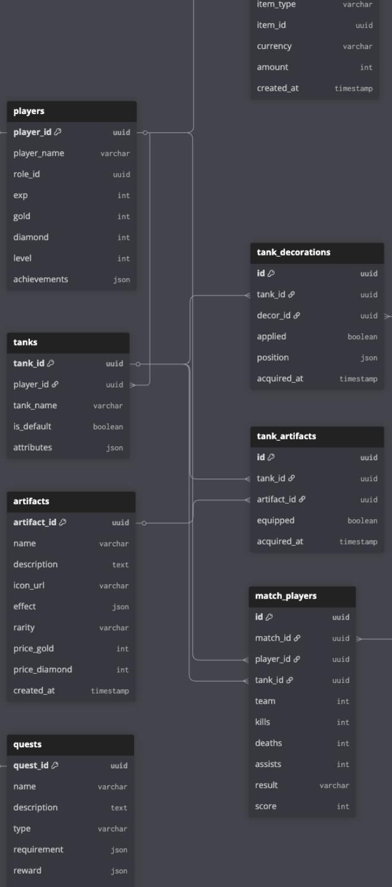
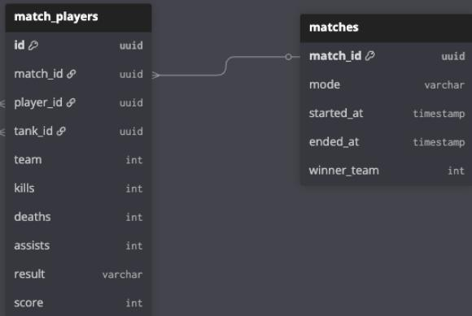
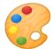

# Design DB schema

https://dbdiagram.io/d/tank-war-db-schema-682aefca1227bdcb4eee723c

<table><tr><td colspan="2">purchases</td></tr><tr><td>purchase_id</td><td>uuid</td></tr><tr><td>player_id</td><td>uuid</td></tr><tr><td>item_type</td><td>varchar</td></tr><tr><td>item_id</td><td>uuid</td></tr><tr><td>currency</td><td>varchar</td></tr><tr><td>amount</td><td>int</td></tr><tr><td>created_at</td><td>timestamp</td></tr></table>

decorations decor_idA uuid type varchar name varchar description text preview_url varchar price_gold int price_diamond int rarity varchar created_at timestamp

<table><tr><td> player_quests</td></tr><tr><td>idp uuid</td></tr><tr><td>player_id uuid</td></tr><tr><td>quest_id&amp; uuid</td></tr><tr><td>progress json status</td></tr><tr><td>varchar</td></tr><tr><td>updated_at timestamp</td></tr></table>

# ?? Core Player & Tank

• players : Thông tin tài khoản người chơi (tên, level, vàng, kim cương, achievements).

• tanks : Danh sách tank mà player sở hữu. Có tank mặc định và tank mở khóa thêm, kèm attributes (tốc độ, dmg, fire rate).

# Customization (Garage)

• decorations : Kho item decor (master data). Gồm 3 loại: wrap, decal, sticker.

• tank_decorations : Liên kết tank decor. Lưu item nào player đã sở hữu và có đang apply không. Với sticker thì lưu luôn vị trí/rotation/scale.

• artifacts : Kho artifact (master data). Mỗi artifact có hiệu ứng đặc biệt (buff).

• tank_artifacts : Liên kết tank artifact. Lưu artifact nào player đã sở hữu và có đang gắn lên tank không.

# Quest System

• quests : Master quest (daily, weekly, event). Định nghĩa yêu cầu và phần thưởng.

• player_quests : Liên kết player quest. Lưu tiến độ (progress), trạng thái (in_progress, completed, claimed).

# Shop & Purchasing

• purchases : Lịch sử giao dịch của player (mua decor, artifact, bundle). Ghi lại loại tiền (gold, diamond, real money).

# Match History

• matches : Thông tin trận đấu (thời gian bắt đầu/kết thúc, chế độ chơi, đội thắng).

• match_players : Liên kết player match. Lưu chi tiết từng người chơi trong trận: tank sử dụng, team, kills, deaths, assists, score, kết quả win/lose/draw.

# Tóm lại

• players, tanks core data người chơi.   
$\bullet$ decorations, artifacts $^ +$ mapping tables) $ { \mathsf { h } } { \hat { \mathsf { e } } }$ thống Garage.   
• quests, player_quests quest system.   
• purchases shop & history.   
• matches, match_players lịch sử trận đấu & leaderboard.