# [Game Mode Module] [Tank War] Deathmatch

THIẾT KẾ GAMEMODE DEATHMATCH

Version: 1.2

Người viết: phucth12 (phucth12)

Ngày tạo: 09 - 09 - 2025

<table><tr><td rowspan=1 colspan=1>Phienban</td><td rowspan=1 colspan=1>Ngay</td><td rowspan=1 colspan=1>Mota</td><td rowspan=1 colspan=1>Ngudi viet</td><td rowspan=1 colspan=1>Nguireview</td><td rowspan=1 colspan=1>Duy@t?</td></tr><tr><td rowspan=1 colspan=1>v1.0</td><td rowspan=1 colspan=1>16-09-2025</td><td rowspan=1 colspan=1>Hoan thanh file</td><td rowspan=1 colspan=1> phucth12</td><td rowspan=1 colspan=1></td><td rowspan=1 colspan=1>□</td></tr><tr><td rowspan=1 colspan=1>v1.1</td><td rowspan=1 colspan=1>17-09-2025</td><td rowspan=1 colspan=1>Format lai file</td><td rowspan=1 colspan=1>P phucth12</td><td rowspan=1 colspan=1></td><td rowspan=1 colspan=1>□</td></tr><tr><td rowspan=1 colspan=1>V1.2</td><td rowspan=1 colspan=1>25-09-2025</td><td rowspan=1 colspan=1>Thiet ké tinh näng version 1.2</td><td rowspan=1 colspan=1> linhttd</td><td rowspan=1 colspan=1></td><td rowspan=1 colspan=1>□</td></tr></table>

# 1.1 Tổng quan thiết kế

Death Mode là chế độ PvP nơi 10 người chơi tham gia vào một trận chiến ngắn kéo dài 4 phút

• Mỗi người điều khiển một Tank riêng và chiến đấu solo

• Trong thời gian giới hạn, người chơi phải tiêu diệt càng nhiều đối thủ càng tốt, và quyết định thắng thua dựa trên người có số Kill cao nhất

• Death Mode giữ nguyên hệ thống nâng cấp chỉ số trong trận tương tự với mode Base Capture

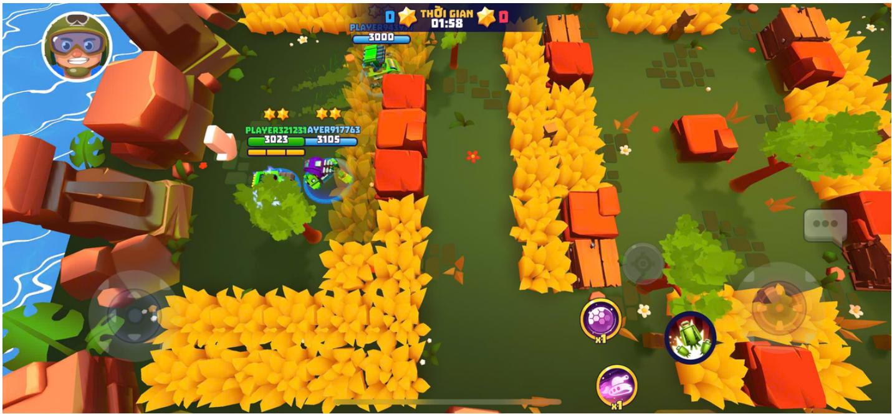

# 1.2 Mục tiêu thiết kế

• Tạo ra một chế độ chơi cạnh tranh giải trí và không mang tính chiến thuật

• Đem đến trải nghiệm “pick up & play” trong 3 phút, dễ dàng cho người chơi quay lại.

• Cung cấp mode giải trí nhưng vẫn mang tính ranking để so sánh thành tích.

# 2. UserFlow

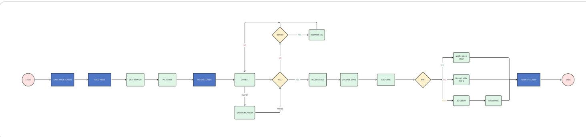

# 3. Chi tiết thiết kế

# 3.1 Core Rules

<table><tr><td colspan="1" rowspan="1"> Mode name</td><td colspan="1" rowspan="1">Deathmatch</td></tr><tr><td colspan="1" rowspan="1"> Total players</td><td colspan="1" rowspan="1">10 nguoichoi</td></tr><tr><td colspan="1" rowspan="1"> Team format</td><td colspan="1" rowspan="1">Solo</td></tr><tr><td colspan="1" rowspan="1"> Match duration</td><td colspan="1" rowspan="1">4phut</td></tr><tr><td colspan="1" rowspan="1"></td><td></td></tr><tr><td colspan="1" rowspan="1">Win condition</td><td colspan="1" rowspan="1">Xép hang dua trén tong só Kill trong trän däu, nguoi có só killcao nhätsé xép hang trén cung va tuong tu cho cac vi tri top duóiNgoai ra sé có mót só tiéu chi xét thäng thua khác trong truδng hop sókill bäng nhau,chi tiét dugc define α: 目[Game Mode Module] [TankWar] Deathmatch (Dang chinh súa)</td></tr><tr><td colspan="1" rowspan="1">Dién tich map</td><td colspan="1" rowspan="1">70x70 Units</td></tr><tr><td colspan="1" rowspan="1">Map setup</td><td colspan="1" rowspan="1">Bui co: än napDäm lay: Divao sé bi giam 10% tóc d@ di chuyén H nuóc: chuóng ngai vät khöng thé di qua, nhung khöng có tácdung chän dan.  Cac vät can có thé́ phá huy khác: cay coi,...</td></tr></table>

# 3.2 Cơ chế chơi

# 1. Matchmaking

◦ Số người chơi: 6 người/trận.

◦ Hình thức ghép: Solo Free-for-All (không chia team).

◦ Quy tắc ghép: Sử dụng quy tắc match making được define tại: [Multiplayer Module] [Tank War] Matchmaking System Design

# 2. Quy tắc Spawn & Respawn

# 2.1 Spawn đầu trận

Số lượng spawn point: 6 điểm được thiết kế sẵn trong map tương ứng với 6 người chơi

◦ Nguyên tắc chọn điểm spawn:

▪ Mỗi người chơi sapwn random tại vị trí bất kỳ trên map, tránh các vị trí có obstacles (nước, bụi cỏ, bùn lầy,...)

# 2.2 Respawn sau khi chết

◦ Thời gian respawn: 3 giây (đếm ngược trên HUD).

◦ Hiệu ứng bất tử: Ngay sau khi respawn, người chơi có 2s nhận được hiệu ứng bất tử. Trong 2s này người chơi sẽ nhận được shield bảo vệ bản thân khỏi mọi loại sát thương. Hết 2s Shield biến mất

◦ Điểm Respawn: Random tại vị trí bất kỳ trên map, tránh các vị trí có obstacles (cỏ/đầm lầy/nước)

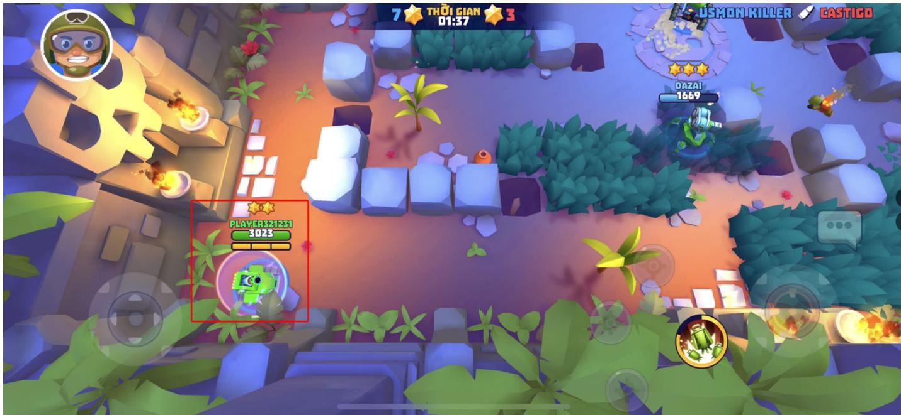

# 3. Cơ chế nâng cấp Tank In-Match

Sử dụng cơ chế nâng cấp Tank giống như mode chơi Capture Base: [Combat Module] [Tank War] Hệ Thống Nâng Cấp Tank In-Match

4. Cơ chế Thắng ‒ Thua & Xếp hạng

# A. Nguyên tắc chung:

• Điều kiện thắng: Khi kết thúc 3 phút, người chơi có số Kill cao nhất sẽ thắng.

• Bảng xếp hạng: Toàn bộ 6 người chơi được xếp hạng từ $1  6$ dựa trên nhiều tiêu chí theo thứ tự ưu tiên.

# B. Thứ tự ưu tiên tiêu chí xếp hạng

Trong trường hợp số Kill bằng nhau, cần xét đến các tiêu chí khác để xếp hạng người chơi, tránh trường hợp đồng hạng

1. Kill (Số mạng hạ gục)

• Tiêu chí chính để xác định thứ hạng.

• Người có nhiều Kill hơn sẽ xếp trên.

2. Death (Số lần bị hạ gục)

• Nếu số Kill đều bằng nhau xét số Death.

• Người có ít Death hơn sẽ được ưu tiên.

3. Damage Dealt (Tổng sát thương gây ra)

• Nếu số Kill và Death bằng nhau, so sánh tổng lượng Damage gây ra cho đối thủ.

• Người gây nhiều sát thương hơn được ưu tiên xếp trên.

# Ví dụ:

• A có 8 Kill, B có 6 Kill $ \mathsf { A }$ xếp trên B.   
• A và B đều có 7 Kill. A chết 2 lần, B chết 4 lần $ \mathsf { A }$ xếp trên B.   
• A và B đều có 6 Kill, 3 Death. A gây 12,000 Damage, B gây 10,000 Damage A xếp trên B

# 3.3 Gold in match

Nguồn Gold In Match

Gold là nguồn tài nguyên nhận được trong trận dùng để nâng cấp chỉ số. Hết trận các chỉ số trả về 0 và Gold còn thừa trong trận sẽ không được giữ lại

Có 2 nguồn để nhận Gold trong trận

1. Gold hạ gục xe địch (Kill Gold)

Người Kill nhận: 80 vàng.   
• Người chết: không mất vàng (tránh snowball).

2. Gold ngẫu nhiên trong trận

# Spawn Rule:

• Tỉ lệ xuất hiện: $5 0 \%$ Nhỏ, $3 5 \%$ Vừa, $1 5 \%$ Lớn.   
• Spawn interval: mỗi 15s   
• Không spawn trong 15s cuối   
• Vị trí spawn: Spawn ngẫu nhiên nhau map mỗi 10s trong vùng Safe Zone. Trong trường hợp Gold được spawn ra và chưa có ai

# Chi tiết:

Random số lượng chest mỗi lần spawn

$$
N _ { c h e s t } ( t ) = R A N D B E T W E E N ( 1 , 4 )
$$

Giai đoạn trận (Phase)

Chia trận 240s thành 3 giai đoạn:

<table><tr><td colspan="1" rowspan="1">Giai doan (s)</td><td colspan="1" rowspan="1">Gold Pack Value</td><td colspan="1" rowspan="1">Xac suat (%)</td></tr><tr><td colspan="1" rowspan="1">0-60</td><td colspan="1" rowspan="1">50,100,200</td><td colspan="1" rowspan="1">50,35,15</td></tr><tr><td colspan="1" rowspan="1">61-100</td><td colspan="1" rowspan="1">100,200,300</td><td colspan="1" rowspan="1">50,35,15</td></tr><tr><td></td><td></td><td></td></tr><tr><td>101-165</td><td>200,300,</td><td>50,35,15</td></tr></table>

Gold Spawn:

$$
G o l d _ { s p a w n } ( t ) = \sum _ { j = 1 } ^ { N _ { c h e s t } ( t ) } G o l d _ { c h e s t } ( t , j , P h a s e ( t ) )
$$

T: thời điểm spawn Nchest(t): số chest spawn tại thời điểm ttt, random từ 1‒4. • Goldchest(t,j,Phase(t)): giá trị Gold của chest thứ jjj, phụ thuộc giai đoạn trận.

Chi phí nâng cấp chỉ số:

$$
\gamma _ { O S t _ { s t a t } } ( k ) = B a s e C o s t \times W I _ { s t a t } \times S t e p G r o w t h _ { s t a t } (
$$

Trong đó:

• WIstat: Weight Index của chỉ số.   
• StepGrowthstat(k): hệ số tăng trưởng tại lần nâng cấp kkk (có thể khác nhau).

Bảng balance: Untitled spreadsheet

# 3.4 Edge Case

• Respawn trong vùng đã bị co: Nếu điểm chết nằm ngoài Safe Zone $ { \mathsf { h } } { \hat { \mathsf { e } } }$ thống tự động chọn spawn point hợp lệ trong Safe Zone gần nhất.

# b. Giao tranh

• Tank bắn và sử dụng skill như bình thường.   
Tank có thể nâng cấp chỉ số của mình thông qua hạt nâng cấp nhận được từ sentry. Đi vào thảm cỏ để ẩn mình.   
Dùng thảm teleport để dịch chuyển nhanh trên map.

# c. Sentry & nâng cấp

Sentry được sắp đặt trước và rải rác trên map.   
Sentry bắn được tank.   
Sentry đứng gần nhau sẽ thành nhóm. 1 nhóm nhiều nhất là 2 sentries.   
Mỗi sentry chỉ thả 1 hạt năng lượng xuống đất.   
Sentry bị phá huỷ sẽ mọc lại sau 1 thời gian.   
Mỗi hạt năng lượng sẽ cho phép người chơi nâng 1 trong 4 chỉ số: HP, SPD, ATK,

# d. Event thời gian

• Sau 30s, mìn sẽ thả xuống/mọc lên(?) xung quanh rìa của map (chiếm \~30% diện tích map) • Với mỗi 30s tiếp theo, mìn sẽ được thả nhiều hơn và sâu hơn vào giữa map. • Mìn giẫm lên sẽ gây 35% tổng HP của người chơi.

-> Hạn chế vùng chơi sẽ bắt các người chơi còn lại giao tranh và kết thúc game.

# 4. Art Requirement

1. Concept - Art Concept cho cơ chế Co Map (Shrinking Arena)

<table><tr><td rowspan=1 colspan=1>Concept</td><td rowspan=1 colspan=1> Map Theme</td><td rowspan=2 colspan=1>RefChienbinhBrawlconlai:70</td></tr><tr><td rowspan=1 colspan=1>Khóidoc</td><td rowspan=1 colspan=1>Phu hop vöi nhieu map</td></tr><tr><td rowspan=1 colspan=1>Dong bang</td><td rowspan=1 colspan=1>Map vung bäng tuyet</td><td rowspan=1 colspan=1></td></tr><tr><td rowspan=1 colspan=1>Lua chay</td><td rowspan=1 colspan=1> Phu hop voi nhieu map</td><td rowspan=1 colspan=1></td></tr><tr><td rowspan=1 colspan=1>Bao cat</td><td rowspan=1 colspan=1>Sa mac</td><td rowspan=1 colspan=1></td></tr></table>

2. UI/UX

A. Wireframe

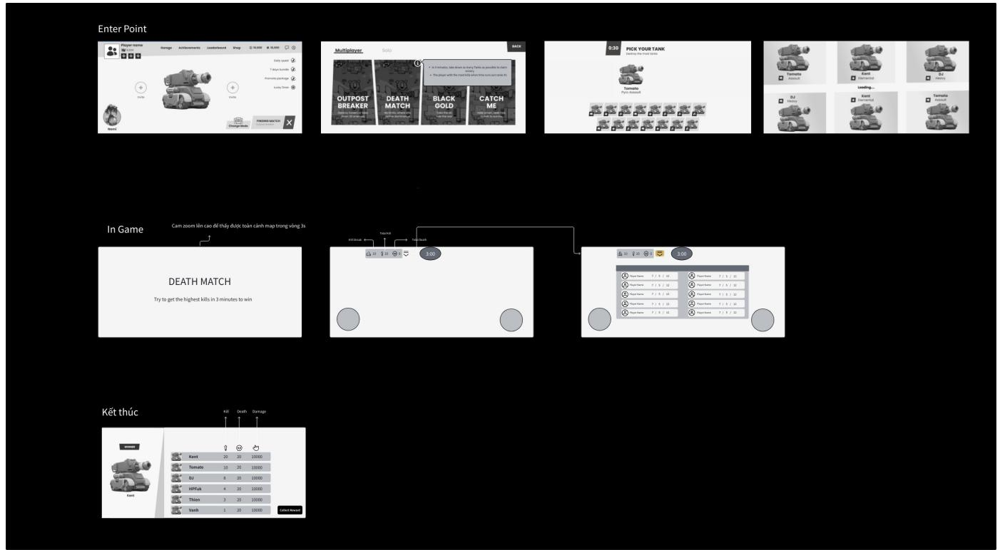

# 3. VFX/Animation

<table><tr><td colspan="1" rowspan="1">#</td><td colspan="1" rowspan="1">Loai</td><td colspan="1" rowspan="1">Ten</td><td colspan="1" rowspan="1">Mo ta</td><td colspan="1" rowspan="1">Trigger</td><td colspan="1" rowspan="1">Ref</td><td colspan="1" rowspan="1">Note</td></tr><tr><td colspan="1" rowspan="1">1</td><td colspan="1" rowspan="1">VFX</td><td colspan="1" rowspan="1">Hieu ung</td><td colspan="1" rowspan="4">1. Tén Game Mode xuat hien lon 8 giua man hinh:Death Match2. Rule choi xuat hiénnhanh 8duói3.Camera zoom léncao de thay toancanh map</td><td colspan="1" rowspan="4">Tat ca hieu ungnay dien ra trong 3s dau sau khivao tran</td><td colspan="1" rowspan="4">BRAWL</td><td colspan="1" rowspan="3">Sudungcho toanb@ mode</td></tr><tr><td colspan="1" rowspan="3"></td><td colspan="1" rowspan="3"></td><td colspan="1" rowspan="1">ten cua</td></tr><tr><td colspan="1" rowspan="2">GameModeCameraZoomOut</td></tr><tr><td colspan="1" rowspan="1">choi khac</td></tr><tr><td colspan="1" rowspan="1">2</td><td colspan="1" rowspan="1">VFX</td><td colspan="1" rowspan="1">VFXShieldbattu</td><td colspan="1" rowspan="1"> Shield bat tu trongtru8ng hgp vua hoisinh</td><td colspan="1" rowspan="1">Ton tai 2s saukhi vua hoi sinh</td><td colspan="1" rowspan="1"></td><td colspan="1" rowspan="1">SudunglaicuaOutpostmode</td></tr><tr><td colspan="1" rowspan="1">3</td><td colspan="1" rowspan="1">VFX</td><td colspan="1" rowspan="1">Demnguocthdi gian</td><td colspan="1" rowspan="1">Trong 10s cuoi cung,bó dem ngugc thoi gian thay doi mau va</td><td colspan="1" rowspan="1">10s cuoi cua trandau</td><td colspan="1" rowspan="1"></td><td colspan="1" rowspan="1">surdunglaicua</td></tr><tr><td colspan="1" rowspan="1"></td><td colspan="1" rowspan="1"></td><td colspan="1" rowspan="1"></td><td colspan="1" rowspan="1">c6 hiéu ung bouncingnhe de thong bao toingu8ichdi</td><td colspan="1" rowspan="1"></td><td colspan="1" rowspan="1"></td><td colspan="1" rowspan="1">Outpostmode</td></tr><tr><td colspan="1" rowspan="2">4</td><td colspan="1" rowspan="2">Tooltip</td><td colspan="1" rowspan="1">Trangthaibattu saukhi hoi</td><td colspan="1" rowspan="2">Tooltip hien thi nhanhkhoang 1-2s roi bienmat: Mien nhiem/battu</td><td colspan="1" rowspan="2">Khi bi tan congtrong thdi gianc6 Shield bat tubao ve (2s saukhi hoi sinh)</td><td colspan="1" rowspan="2"></td><td colspan="1" rowspan="1">SudunglaicuaOutpost</td></tr><tr><td colspan="1" rowspan="1">khi hoisinh</td><td colspan="1" rowspan="1">mode</td></tr></table>

# 4. Map Layout

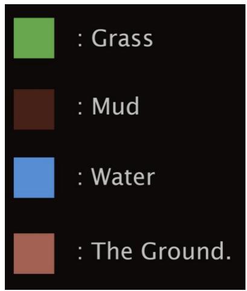

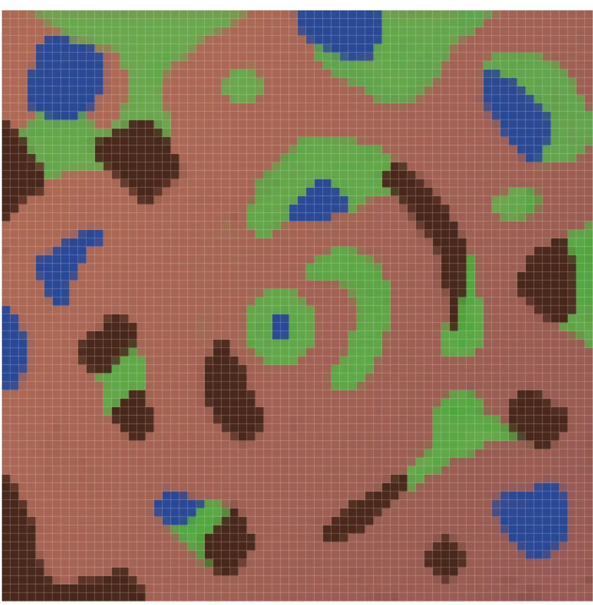  
Map Layout

# Balancing

# a. Gameflow mong muốn

<table><tr><td rowspan=1 colspan=1>Thong so</td><td rowspan=1 colspan=1>Duftinh</td></tr><tr><td rowspan=1 colspan=1>Th8i gian trung binh tran</td><td rowspan=1 colspan=1>1.5 mins</td></tr><tr><td rowspan=1 colspan=1>Trung binh so lan nang skilttrong tran</td><td rowspan=1 colspan=1>10tan</td></tr><tr><td rowspan=1 colspan=1> S6 tugng tham teleport</td><td rowspan=1 colspan=1>4e</td></tr></table>

# b. Kinh tế

<table><tr><td rowspan=1 colspan=1>Thong so</td><td rowspan=1 colspan=1>So tuiong</td></tr><tr><td rowspan=1 colspan=1>Tong sentries</td><td rowspan=1 colspan=1>12 sentries</td></tr><tr><td rowspan=1 colspan=1>S6 lan dugc nang 1 chi s6</td><td rowspan=1 colspan=1>5lan</td></tr></table>

<table><tr><td rowspan=1 colspan=1>Event</td><td rowspan=1 colspan=1> Thdi gian duytinh</td><td rowspan=1 colspan=1> Hat nang tuong nhänduge</td><td rowspan=1 colspan=1> Hat nang luong matdi</td></tr><tr><td rowspan=1 colspan=1>Sentry bi pha huy</td><td rowspan=1 colspan=1>5(s)</td><td rowspan=1 colspan=1>士</td><td rowspan=1 colspan=1></td></tr><tr><td rowspan=1 colspan=1> Sentry hoi phue</td><td rowspan=1 colspan=1>30 (s)</td><td rowspan=1 colspan=1>=</td><td rowspan=1 colspan=1>=</td></tr><tr><td rowspan=1 colspan=1>Mua chis6</td><td rowspan=1 colspan=1>=</td><td rowspan=1 colspan=1>=</td><td rowspan=1 colspan=1>4</td></tr><tr><td rowspan=1 colspan=1> Phá huy tank dich</td><td rowspan=1 colspan=1>15s</td><td rowspan=1 colspan=1> Hat nang luong tankdich so htu</td><td rowspan=1 colspan=1></td></tr></table>

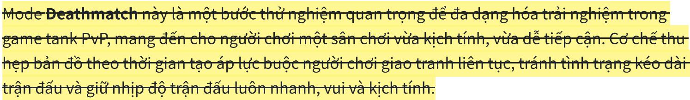

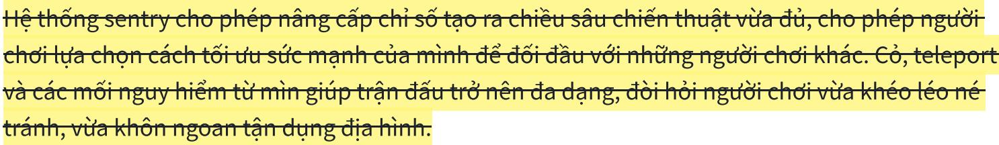

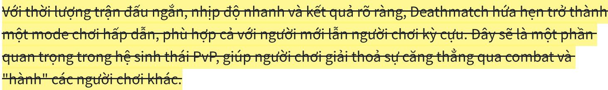

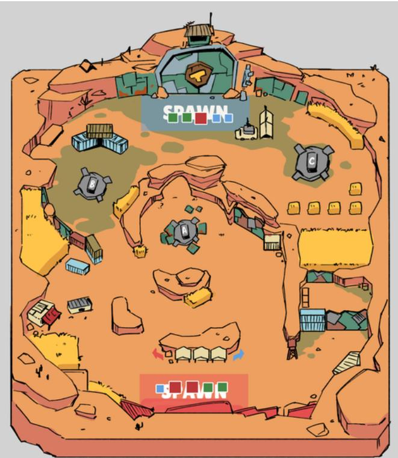

Scalability & Future Additions

a. Bổ sung Môi trường & Sự kiện

• Sự kiện ngẫu nhiên (RNG Events):

◦ Thời tiết thay đổi (mưa, sấm sét, tuyết) ảnh hưởng tầm nhìn hoặc tốc độ di chuyển.   
◦ Quái xâm lược hoặc boss nhỏ xuất hiện, cho buff khi tiêu diệt.

Địa hình động:

◦ Thêm các loại địa hình gây ảnh hưởng gameplay như: làm chậm, trơn trượt, gây sát thương theo thời gian. ◦ Cỏ có thể biến mất tạm thời ở một số giai đoạn, tạo khoảng trống bắt buộc giao tranh.

# Vật phẩm đặc biệt:

◦ Sinh ra “Divine Rapier” (vũ khí mạnh) tại giữa map sau X phút, tạo điểm tranh chấp.   
◦ Hộp tiếp tế ngẫu nhiên xuất hiện, chứa buff hoặc hạt nâng cấp.

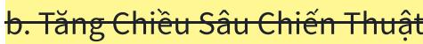

• Hệ thống Headhunt / Kill Spree:

◦ Ghi nhận kill streak, thưởng tài nguyên hoặc buff cho người đang “on fire”.   
◦ Thêm cơ chế “bounty” ‒ càng sống lâu và giết nhiều, giá trị bị săn càng cao.

Chế tạo vũ khí nâng cấp:

◦ Giết địch hoặc phá sentry thu thập nguyên liệu, cho phép ghép thành một loại vũ khí/skill mạnh một lần trong trận.

Mốc Thưởng (Milestone Buffs):

◦ Đạt đủ số kill hoặc số nâng cấp nhất định để nhận buff tạm thời (tốc bắn, tốc chạy, hồi máu).

c. Điều chỉnh Tương Tác Người Chơi

# Fog of War:

◦ Giảm tầm nhìn hoặc thêm màn sương mờ dày dần khi map thu hẹp.

d. Điều Chỉnh Kinh Tế Trận Đấu

# Farming Crates:

Người chơi kiếm tài nguyên từ crate hoặc kill thay vì chỉ từ sentry, giúp đa dạng nguồn nâng cấp.

# • Cân bằng tần suất hạt năng lượng:

◦ Điều chỉnh số lượng hạt rơi ra từ sentry, tank địch và event để tránh quá mạnh hoặc quá yếu.