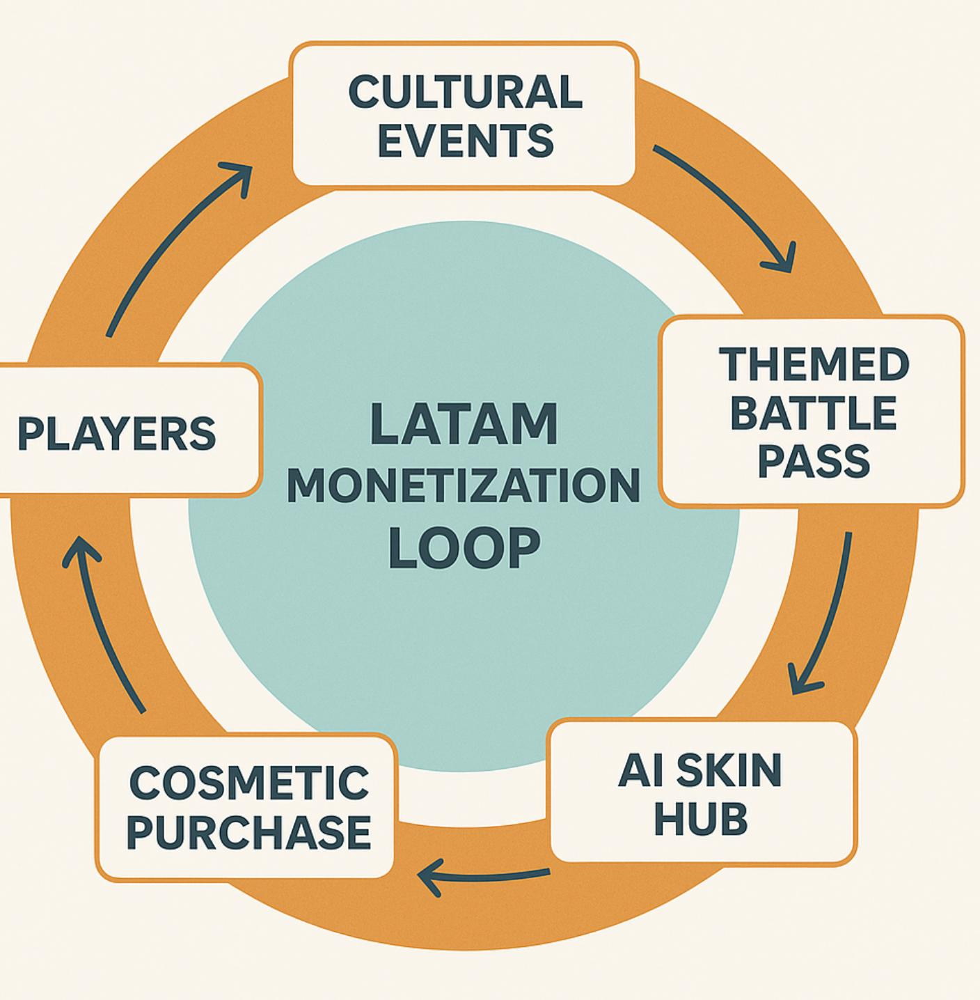

# [Monetization Module] [Tank War] Monetization Localization (LATAM)

# Monetization Localization Addendum

Region: Latin America (LATAM) Prepared by: $\bullet$ Kent Date: 2025.11

<table><tr><td rowspan=1 colspan=1>Phienban</td><td rowspan=1 colspan=1>Ngay</td><td rowspan=1 colspan=1>Mo ta</td><td rowspan=1 colspan=1>Ngudi viet</td><td rowspan=1 colspan=1>Nguoireview</td><td rowspan=1 colspan=1>Duyét?</td></tr><tr><td rowspan=1 colspan=1>v1.0</td><td rowspan=1 colspan=1>03-11-2025</td><td rowspan=1 colspan=1>Taofile</td><td rowspan=1 colspan=1> Kent</td><td rowspan=1 colspan=1></td><td rowspan=1 colspan=1>□</td></tr><tr><td rowspan=1 colspan=1></td><td rowspan=1 colspan=1></td><td rowspan=1 colspan=1></td><td rowspan=1 colspan=1></td><td rowspan=1 colspan=1></td><td rowspan=1 colspan=1>□</td></tr></table>

# 1. Objective

Mục tiêu của phần bổ sung này là tối ưu hóa hệ thống monetization của Tank War cho thị trường Mỹ Latinh, đảm bảo:

• Giữ nguyên cấu trúc doanh thu cốt lõi (Battle Pass ‒ Cosmetics ‒ VIP ‒ Rewarded Ads).   
• Điều chỉnh cách đóng gói, định giá và trình bày phù hợp với hành vi tiêu dùng & văn hóa địa phương.   
• Xây dựng trải nghiệm “fair but festive” ‒ không gây cảm giác pay-to-win, mà mang lại niềm vui, tự hào văn hóa và khả năng biểu đạt cá tính.

# 2. System Overview

<table><tr><td rowspan=1 colspan=1>Core Mechanic</td><td rowspan=1 colspan=1>LATAM Adaptation</td><td rowspan=1 colspan=1>Design Int</td></tr><tr><td rowspan=1 colspan=1> Battle Pass</td><td rowspan=1 colspan=1>Bién thanh “Regional Pass” (themed theo vän hóa quoc gia).Vi du: Carnaval Pass, Dia de Muertos Pass, Copa de la Liga Pass.</td><td rowspan=1 colspan=1> Giu Battle Pass la tru cot doanh t ket noi cam xuc qua biéu tuong v</td></tr><tr><td rowspan=1 colspan=1>CosmeticStore</td><td rowspan=1 colspan=1>M rong thém Al Skin Hub - noi nguαi choi tu&#x27; tao skin bäng Alprompt.</td><td rowspan=1 colspan=1>Bién customization thanh “creacäm giác só hüu &amp; khuyén khich</td></tr><tr><td rowspan=1 colspan=1> Crate System</td><td rowspan=1 colspan=1> Chuyen sang Transparent Reward Pool: hien thi % drop va cho phép chon item sau 10 län mó.</td><td rowspan=1 colspan=1> Giu dong luc m&amp; hop, nhung loaid tin cäy va thién cam voi thuor</td></tr><tr><td rowspan=1 colspan=1>VIP Membership</td><td rowspan=1 colspan=1>Rebrand thanh “Tank Crew Club”,nhän vao loiich tien dung(time-saver, cosmetic bonus) thay vi buff suc manh.</td><td rowspan=1 colspan=1>Giu doanh thu dinh ky ma khongcua LATAM.</td></tr><tr><td rowspan=1 colspan=1>Rewarded Ads</td><td rowspan=1 colspan=1>Täng tän suat,bö sung Local Reward Token (doi vät phäm su kién) thay vi chi gold/gem.</td><td rowspan=1 colspan=1>Bién quang cáo thanh phän thuc giam tinh thuong mai.</td></tr><tr><td rowspan=1 colspan=1> Events &amp; LiveOps</td><td rowspan=1 colspan=1> M&amp; lich LiveOps cultural calendar co dinh: Carnaval, Dia deMuertos, Copa de la Liga, Black Friday.</td><td rowspan=1 colspan=1> Gän hé thong monetization vao rconversion tu nhién va giu nhip r</td></tr></table>

# 3. Regional Adaptation Breakdown

# 3.1 Battle Pass Localization

# ◦ Concept:

Mỗi khu vực có một Battle Pass với chủ đề riêng, vừa tạo khác biệt nội dung, vừa kích thích chi tiêu định kỳ.

<table><tr><td rowspan=1 colspan=1>Country</td><td rowspan=1 colspan=1> Pass Name</td><td rowspan=1 colspan=1>Theme &amp; Content</td><td rowspan=1 colspan=1>Price</td></tr><tr><td rowspan=1 colspan=1>Brazil</td><td rowspan=1 colspan=1>Carnaval Pass</td><td rowspan=1 colspan=1>Skin neon,pháo hoa, hieu ung samba,äm thanh lé hi</td><td rowspan=1 colspan=1>BR $29.99</td></tr><tr><td rowspan=1 colspan=1>Mexico</td><td rowspan=1 colspan=1>Dia de Muertos Pass</td><td rowspan=1 colspan=1>Dia de Muertos Pass Tank skull decal,hieu ung son duong keo,mau tim cam MXN 149</td><td rowspan=1 colspan=1>MXN 149</td></tr><tr><td rowspan=1 colspan=1>Argentina</td><td rowspan=1 colspan=1>Copa de la LigaPass</td><td rowspan=1 colspan=1>Skin theo mau áo di tuyén quoc gia,cup chien thäng</td><td rowspan=1 colspan=1>ARS 8,000 (dieu cphat)</td></tr></table>

# ◦ Design Notes:

▪ Mỗi pass kéo dài 4 tuần, có skin exclusive $^ +$ event badge.

▪ Gắn nhiệm vụ mạng xã hội: “Share 3 clips with hashtag #MiTanqueIA to earn +10 Battle Points”

▪ Battle Pass UI thay đổi nền và biểu tượng theo sự kiện quốc gia.

# 3.2 AI Skin Hub

# ◦ Core Loop:

Người chơi nhập prompt $ \mathsf { A l }$ sinh skin $ { \mathsf { C } } { \mathsf { 0 } }$ thể đăng lên Gallery Cộng đồng bình chọn.

# ◦ Gameplay Integration:

Skin được vote nhiều nhất mỗi tuần được tặng tag “Creator Choice”. Top 100 skin dùng nhiều nhất nhận Creator Badge $+$ vật phẩm đặc biệt. ▪ Người chơi có thể “remix” skin của người khác tạo vòng lan tỏa sáng tạo.

# ◦ Monetization Hook:

▪ Mỗi lượt generate hoặc publish skin sử dụng AI Token (mua bằng gem hoặc earn từ Battle Pass). ▪ Người chơi có thể mua “Premium Canvas” để xuất skin với hiệu ứng hiếm.

Muc tieu:bien customization thanh cong cu marketing tu nhien

# 3.3 Transparent Crate System

• Problem: LATAM không thích yếu tố ngẫu nhiên ẩn cảm giác “cờ bạc”.

• Solution: “Clarity $^ +$ Choice”.

<table><tr><td rowspan=1 colspan=1>Feature</td><td rowspan=1 colspan=1>Description</td></tr><tr><td rowspan=1 colspan=1>Drop Info</td><td rowspan=1 colspan=1> Hien thi ti lé rdi tung vät phäm (VD: Epic 20%,Rare 40%).</td></tr><tr><td rowspan=1 colspan=1>Progress GuaranteeS</td><td rowspan=1 colspan=1>Sau 10 lan m&amp;, nguoi choi có thé chon 1 item trong pool.</td></tr><tr><td rowspan=1 colspan=1>Conversion</td><td rowspan=1 colspan=1>Hop mα nhieu lan tu dongtich diem “Select Token” dé di phan thuong mongmuon.</td></tr></table>

# • Result:

◦ Tăng lòng tin, giảm khiếu nại.   
◦ Giữ động lực “mở thưởng” mà không bị xem là RNG thuần túy.

# 3.4 VIP Membership Tank Crew Club

• Concept: Định vị lại gói VIP thành một “membership” xã hội hơn là pay-for-power.

# • Perks Design:

◦ $+ 1 0 \%$ EXP & Coin (time-saving).   
◦ Nhận Crew Crate hàng tuần (chỉ cosmetic).   
◦ Access to exclusive voice line / badge / decal.   
◦ “Early access” cho event skin.

Emotional Hook:

# 3.5 Rewarded Ads Rework

# • Goal:

Giữ chân người chơi F2P bằng hệ thống thưởng hữu ích, không làm gián đoạn trải nghiệm.

<table><tr><td rowspan=1 colspan=1> Reward Type</td><td rowspan=1 colspan=1>Example</td><td rowspan=1 colspan=1>Frequency</td></tr><tr><td rowspan=1 colspan=1>Coin /Gem</td><td rowspan=1 colspan=1>Nhän 10-30 gem sau mi clip xem</td><td rowspan=1 colspan=1>3lan/ngay</td></tr><tr><td rowspan=1 colspan=1>Local Token</td><td rowspan=1 colspan=1>“Carnaval Token”，“Muertos Coin” dungdeé doiskin event</td><td rowspan=1 colspan=1>Gän voi event</td></tr><tr><td rowspan=1 colspan=1>Social Bonus</td><td rowspan=1 colspan=1> Nhän thém thuäng néu share clip lén mang xä hói</td><td rowspan=1 colspan=1>1 lan/ngay</td></tr></table>

# 3.6 Cultural Event Calendar (LiveOps Loop)

• Cấu trúc 1 năm sự kiện chính:

<table><tr><td rowspan=1 colspan=1>Month</td><td rowspan=1 colspan=1>Event</td><td rowspan=1 colspan=1>Type</td><td rowspan=1 colspan=1>Expected Revenue Spike</td></tr><tr><td rowspan=1 colspan=1>Feb-Mar</td><td rowspan=1 colspan=1>Carnaval (Brazil)</td><td rowspan=1 colspan=1>Themed Pass + Live Battle</td><td rowspan=1 colspan=1>3x-4x</td></tr><tr><td rowspan=1 colspan=1>Jun</td><td rowspan=1 colspan=1>Festa Junina (Brazil)</td><td rowspan=1 colspan=1> Mini cosmetic event</td><td rowspan=1 colspan=1>2x</td></tr><tr><td rowspan=1 colspan=1>Sep</td><td rowspan=1 colspan=1>Independence Day (Mexico)</td><td rowspan=1 colspan=1>Limited Skin Bundle</td><td rowspan=1 colspan=1>2x-3x</td></tr><tr><td rowspan=1 colspan=1>Oct-Nov</td><td rowspan=1 colspan=1>Dia de Muertos (Mexico)</td><td rowspan=1 colspan=1>Al skin theme event</td><td rowspan=1 colspan=1>4x-5x</td></tr><tr><td rowspan=1 colspan=1>Nov</td><td rowspan=1 colspan=1>Black Friday (All)</td><td rowspan=1 colspan=1>Flash sale 60-70%</td><td rowspan=1 colspan=1>5x-8x</td></tr><tr><td rowspan=1 colspan=1>Dec</td><td rowspan=1 colspan=1>Copa de la Liga (Argentina)</td><td rowspan=1 colspan=1>Sports-themed battle</td><td rowspan=1 colspan=1>3x</td></tr></table>

# 4. KPI Impact Estimation

<table><tr><td rowspan=1 colspan=1>Metric</td><td rowspan=1 colspan=1>Expected Lift</td><td rowspan=1 colspan=1>Rationale</td></tr><tr><td rowspan=1 colspan=1>D7 Retention</td><td rowspan=1 colspan=1>+3-5%</td><td rowspan=1 colspan=1>Daily mission cong dong &amp; Battle Pass themed task</td></tr><tr><td rowspan=1 colspan=1>Conversion to payer</td><td rowspan=1 colspan=1>+1-1.5%</td><td rowspan=1 colspan=1>Localized payment &amp; cultural event push</td></tr><tr><td rowspan=1 colspan=1>ARPPU</td><td rowspan=1 colspan=1>+10-15%</td><td rowspan=1 colspan=1>Personalized pass &amp; cosmetic ecosystem</td></tr><tr><td rowspan=1 colspan=1>Social engagement</td><td rowspan=1 colspan=1>+200-300%</td><td rowspan=1 colspan=1>Al Skin viral &amp; Creator ranking loop</td></tr><tr><td rowspan=1 colspan=1>Churn rate</td><td rowspan=1 colspan=1>-5-8%</td><td rowspan=1 colspan=1>Cultural attachment &amp; visual expression system</td></tr></table>

# 5. Implementation Priority Matrix

<table><tr><td rowspan=1 colspan=1>Priority</td><td rowspan=1 colspan=1>Feature</td><td rowspan=1 colspan=1>Reason</td></tr><tr><td rowspan=1 colspan=1>High</td><td rowspan=1 colspan=1>Localized Battle Pass</td><td rowspan=1 colspan=1>Revenue core + cultural resonance</td></tr><tr><td rowspan=1 colspan=1>High</td><td rowspan=1 colspan=1>Al Skin Hub</td><td rowspan=1 colspan=1>Viral differentiator for LATAM</td></tr><tr><td rowspan=1 colspan=1>High</td><td rowspan=1 colspan=1>Payment &amp; Pricing localization</td><td rowspan=1 colspan=1>Critical monetization enabler</td></tr><tr><td rowspan=1 colspan=1>Medium</td><td rowspan=1 colspan=1>Transparent Crate System</td><td rowspan=1 colspan=1> Improves trust, long-term retention</td></tr><tr><td rowspan=1 colspan=1>Medium</td><td rowspan=1 colspan=1>Tank Crew Club</td><td rowspan=1 colspan=1>Sustains monthly revenue</td></tr><tr><td rowspan=1 colspan=1>High</td><td rowspan=1 colspan=1>Event Calendar (LiveOps LATAM)</td><td rowspan=1 colspan=1>Drives periodic spending &amp; engagement</td></tr><tr><td rowspan=1 colspan=1>Optional</td><td rowspan=1 colspan=1>Social Share Missions</td><td rowspan=1 colspan=1>Secondary retention booster</td></tr></table>

# 6. Summary

“In LATAM, players don’t just buy to win — they buy to belong.”

Hệ thống monetization của Tank War không cần tái thiết kế, mà cần được tái cảm nhận:

• Mỗi lượt mua mang yếu tố cá nhân & văn hóa.   
• Mỗi sự kiện mang màu sắc địa phương.   
. Mỗi skin mang dấu ấn sáng tạo người chơi.

Đây chính là trục “Cultural Economy Loop” — nơi giá trị không nằm ở sức mạnh, mà ở niềm tự hào được thể hiện bản thân.

