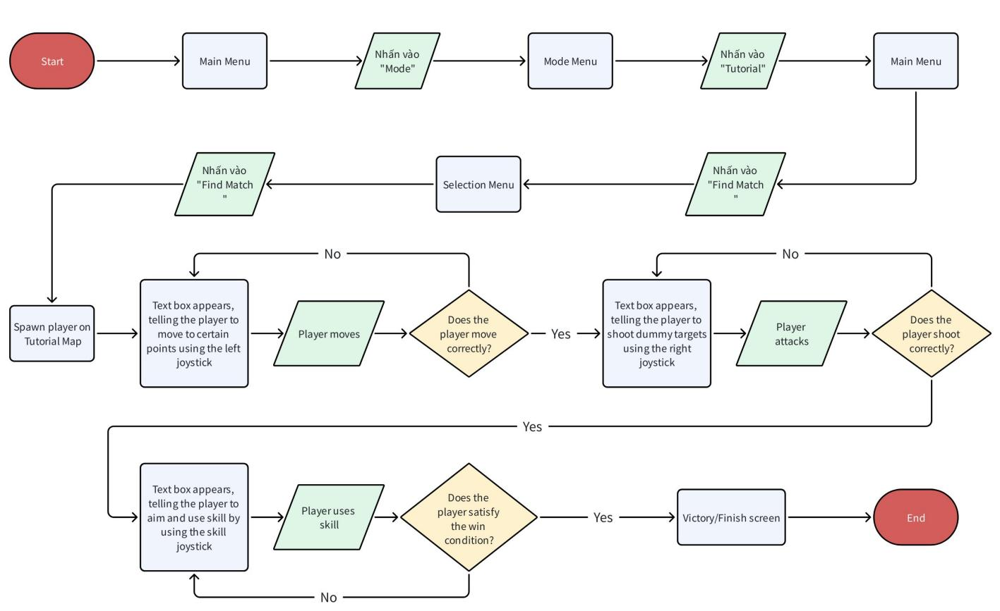

# [Progression Module] [Tank War] Onboarding Tutorial Mode Design

THÔNG TIN THIẾT KẾ CHẾ ĐỘ TUTORIAL ONBOARDING

Version: v1.0   
Người viết: $\textcircled { \circ }$ phucth12 (phucth12)   
Ngày tạo: 20 - 08 - 2025

<table><tr><td rowspan=1 colspan=1>Phienban</td><td rowspan=1 colspan=1>Ngay</td><td rowspan=1 colspan=1>Mota</td><td rowspan=1 colspan=1>Nguoi viet</td><td rowspan=1 colspan=1>Nguoireview</td><td rowspan=1 colspan=1>Duyét?</td></tr><tr><td rowspan=1 colspan=1>v1.0</td><td rowspan=1 colspan=1>20-08-2025</td><td rowspan=1 colspan=1>Hoan thanh file</td><td rowspan=1 colspan=1>®phucth12</td><td rowspan=1 colspan=1></td><td rowspan=1 colspan=1>□</td></tr><tr><td rowspan=1 colspan=1>v1.1</td><td rowspan=1 colspan=1>13-11-2025</td><td rowspan=1 colspan=1>Dieu chinh</td><td rowspan=1 colspan=1> Kent</td><td rowspan=1 colspan=1></td><td rowspan=1 colspan=1></td></tr></table>

# 1. Mục đích thiết kế

Thiết giúp người chơi mới hiểu rõ các cơ chế chơi cơ bản trong game bao gồm di chuyển, nhắm bắn và xài kỹ năng.

# 2. Mục tiêu thiết kế

• Giới thiệu đầy đủ các cơ chế chơi căn bản của Tank Wars qua các giai đoạn.   
Người chơi có thể hiểu và hoàn thành các yêu cầu dễ dàng.   
• Tạo cảm giác thoải mái và mong muốn chơi thêm từ người chơi.

# 3. Mục tiêu & tổng quan tài liệu

Tài liệu được dùng để giúp đội Art & Dev hình dung rõ ràng hơn về mode Tutorial của game.

4. Thành phần   
5. Giai đoạn và flow tutorial   
6. Userflow   
7. Notes

# 4. Thành phần

<table><tr><td rowspan=1 colspan=1> Thanhphan</td><td rowspan=1 colspan=1> Muc dich</td><td rowspan=1 colspan=1>Mieu tä</td><td rowspan=1 colspan=1>Note</td></tr><tr><td rowspan=1 colspan=1>MapTutorial</td><td rowspan=1 colspan=1> Man choi cua ché dóTutorial</td><td rowspan=1 colspan=1>·Map nhó (&lt;= 25x25 units)· C6vät can,vät trang tri tuythich</td><td rowspan=1 colspan=1></td></tr><tr><td rowspan=1 colspan=1>Muc tieu&amp; Textbox</td><td rowspan=1 colspan=1>Dieu kien hoan thanhmap &amp; textbox hien thicac dieu kien</td><td rowspan=1 colspan=1>：  Muc tieu hien thi trén texbox tuong ung voi giai doan</td><td rowspan=1 colspan=1></td></tr><tr><td rowspan=1 colspan=1>Tank</td><td rowspan=1 colspan=1>Player</td><td rowspan=1 colspan=1>：Cho phép su dung tank tuythich</td><td rowspan=1 colspan=1>Tuy vao class tank dudcchon ma muc tieu giaidoan 3 sé thay doi</td></tr><tr><td rowspan=1 colspan=1>Move joystick</td><td rowspan=1 colspan=1>Cho phép player dichuyen</td><td rowspan=1 colspan=1></td><td rowspan=1 colspan=1></td></tr><tr><td rowspan=1 colspan=1>Shootjoystick</td><td rowspan=1 colspan=1>Cho phép player bän</td><td rowspan=1 colspan=1></td><td rowspan=1 colspan=1></td></tr><tr><td rowspan=1 colspan=1> Skill button</td><td rowspan=1 colspan=1>Cho phép player sudung skill</td><td rowspan=1 colspan=1></td><td rowspan=1 colspan=1></td></tr><tr><td rowspan=1 colspan=1>Pin</td><td rowspan=1 colspan=1>Checkpoint cua giaidoan Moving</td><td rowspan=1 colspan=1>Pin nhó (size &lt;= 2x2 units)</td><td rowspan=1 colspan=1></td></tr><tr><td rowspan=1 colspan=1>Dummytanks</td><td rowspan=1 colspan=1> Muc tieu bän trong giai doan Shooting vaUsing A Skill</td><td rowspan=1 colspan=1>：C6 tank dung yén lan tank dichuyén：  Cäc dummy tanks khong bänngu8i chdi</td><td rowspan=1 colspan=1> Sau nay có thé xem xét áp dung tank ngäm bänva player né dan va di chuyén toi muc tiéu trong giai doan Moving</td></tr></table>

# 5. Giai đoạn và flow tutorial

Quá trình chơi Tutorial được chia thành 3 giai đoạn, tương ứng với 3 cơ chế khác nhau:

1. Moving   
2. Shooting   
3. Using a skill

<table><tr><td colspan="1" rowspan="1">Flow</td><td colspan="1" rowspan="1">Giaidoan</td><td colspan="1" rowspan="1"> Kich ban</td><td colspan="1" rowspan="1">H trd user</td><td colspan="1" rowspan="1">Diéu kién hoan thanh</td><td colspan="1" rowspan="1">Notes</td></tr><tr><td colspan="1" rowspan="1">0</td><td colspan="1" rowspan="1">-</td><td colspan="1" rowspan="1"> User chon tank</td><td colspan="1" rowspan="1"></td><td colspan="1" rowspan="1">Thdi gian demngudc</td><td colspan="1" rowspan="1"></td></tr><tr><td colspan="1" rowspan="1">1</td><td colspan="1" rowspan="1">1</td><td colspan="1" rowspan="1"> Player spawn trén map·Hien thi Move Joystick·  Hien thi 1 Pin·  Hien thi Text Box voi noi dung "Move to the point!"</td><td colspan="1" rowspan="1"> Lam toi män hinh ngoai tru joystick khi yéu cäu nguoichdi di chuyén</td><td colspan="1" rowspan="1"> Player hoan tat di chuyén tói point Hién thi "Nice!" vachuyen flow</td><td colspan="1" rowspan="1">Pin cachnguoi chdi~8 units</td></tr><tr><td colspan="1" rowspan="3">2</td><td colspan="1" rowspan="3">1</td><td colspan="1" rowspan="3"> Hién thi 3 pins：  Hien thi Text Box voi noi dung "Move to the points! (0/3)"</td><td colspan="1" rowspan="3"></td><td colspan="1" rowspan="1"> Player hoan tät dichuyén töi cä 3 points</td><td colspan="1" rowspan="2"> 3 pins cach nhau &gt;= 10unitsTextboxdudc capnhat voi</td></tr><tr><td colspan="1" rowspan="1"> Hien thi "Nice job!" va chuyén</td></tr><tr><td colspan="1" rowspan="1"> giai doan</td><td colspan="1" rowspan="1">mi pins tim dugc</td></tr><tr><td colspan="1" rowspan="1">3</td><td colspan="1" rowspan="1">2</td><td colspan="1" rowspan="1">Hién thi thém Shoot· Joystick： Spawn 1 tank： Hien thi Text Box voi noi dung"Destroy the tank!"</td><td colspan="1" rowspan="1"> Lam toi man hinh ngoai tru Shooting Joystick khi yéu cau nguαi choi bän</td><td colspan="1" rowspan="1"> Player bän phadugc tank Hién thi "Nice job!" va chuyenflow</td><td colspan="1" rowspan="1"> Tank cachngudi choi~8 units</td></tr><tr><td colspan="1" rowspan="1">4</td><td colspan="1" rowspan="1">2</td><td colspan="1" rowspan="1">·  Spawn 2 tanks tai vi tri ngäu nhien trén map：  Hien thi Text Box voi noi dung "Find and destroythe tanks! (0/2)"</td><td colspan="1" rowspan="1"></td><td colspan="1" rowspan="1"> Player phä dugc 2 tanks Hieén thi "Nice job!" va chuyen giai doan</td><td colspan="1" rowspan="1"> Textboxdugc capnhät voi mi tanks phä dugc</td></tr><tr><td colspan="1" rowspan="1"></td><td colspan="1" rowspan="1">3</td><td colspan="1" rowspan="1">· Spawn 1 tank di chuyén</td><td colspan="1" rowspan="1"></td><td colspan="1" rowspan="1"></td><td colspan="1" rowspan="1"></td></tr><tr><td colspan="1" rowspan="1">5-</td><td colspan="1" rowspan="2"></td><td colspan="1" rowspan="2">· Tät nut Shooting Joystick Hien thi Skill Button Hien thi Text Box voi noidung "Destroy the tankusing your skill!"</td><td colspan="1" rowspan="1">Lam toi man hinh</td><td colspan="1" rowspan="2"> Player phä dugc tank Hien thi "Nice job!" va dän tói man hinh Victory</td><td colspan="1" rowspan="2"></td></tr><tr><td colspan="1" rowspan="1">Scout</td><td colspan="1" rowspan="2"> ngoai tru Skill Button 1 luc ngän khi möi bät däu giai doan 3 Khöng cho player tuong täc voi gamedén khi män hinhsäng lai</td></tr><tr><td colspan="1" rowspan="1">5-Assault</td><td colspan="1" rowspan="1">3</td><td colspan="1" rowspan="1">： Spawn 1 tank di chuyén Tät nut Shooting. Joystick Hién thi Skill Button·  Hién thi Text Box voi noi dung "Trap the tank  using your skil!"</td><td colspan="1" rowspan="1">Player bäy dugc tank thanh cong Hién thi "Nice job!" va dän tói man hinh Victory</td><td colspan="1" rowspan="1"></td></tr><tr><td colspan="1" rowspan="1">5-</td><td colspan="1" rowspan="1"></td><td colspan="1" rowspan="2">.  Spawn 1 tank di chuyén Tät nut ShootingJoystick Hien thi Skill Button Hién thi Text Box voi noidung "Drag the tank close using your ski!"</td><td colspan="1" rowspan="2">Lam toi män hinhngoai tru Skill Button 1 luc ngän khi moi bät däu giai doan 3 Khöng cho player tuong tac vi gamedén khi män hinhsäng lai Player bi gioi hanvao 1 vung gioi hannhó de bu@c nguoi choi xai skill tu xa</td><td colspan="1" rowspan="2">Player kéo du@c tank vé thänhcong Hién thi "Nice job!" va dan tói man hinh Victory</td><td colspan="1" rowspan="2">Vung gioihan cachdich~15units</td></tr><tr><td colspan="1" rowspan="1">Heavy</td><td colspan="1" rowspan="1">3</td></tr><tr><td colspan="1" rowspan="1">6</td><td colspan="1" rowspan="1"></td><td colspan="1" rowspan="1">User hoan thanh tutorial vanhan thuong</td><td colspan="1" rowspan="1"></td><td colspan="1" rowspan="1"></td><td colspan="1" rowspan="1"></td></tr></table>

Không hiển thị các UI khác ngoài các UI được liệt kê trong bảng

# 6. Userflow

# 7. Notes

Tutorial này giới thiệu các tính năng chơi chung, những tutorial cho các mode riêng biệt sẽ được thêm vào sau này :D