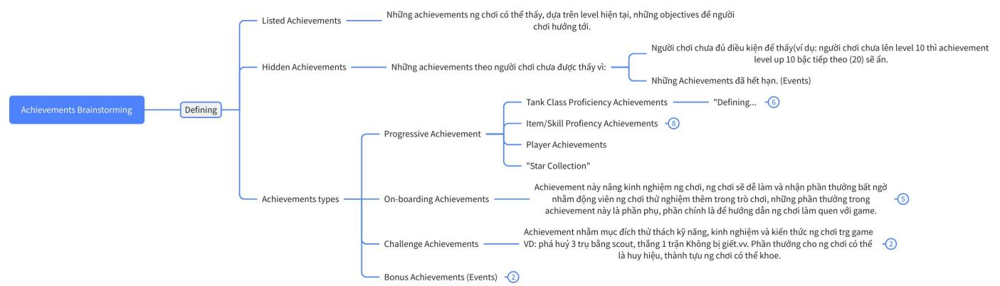
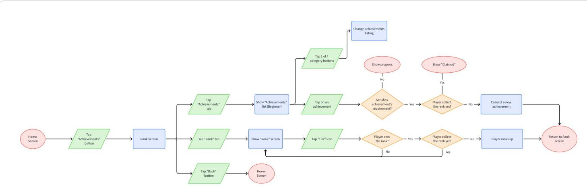
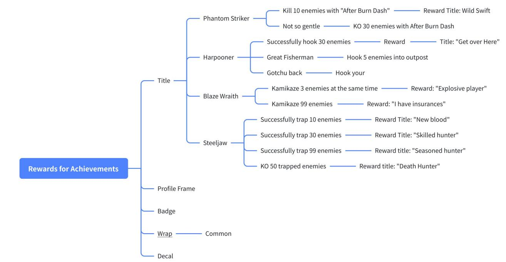
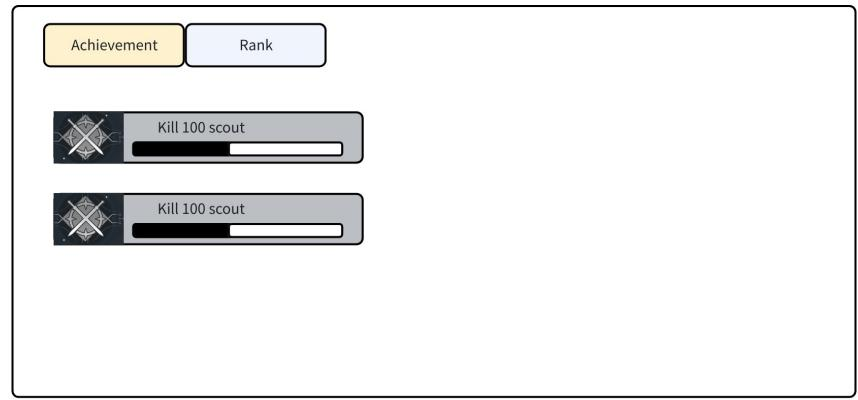

# [Progression Module] [Tank Wars] Achievement Design

LIỆT KÊ ACHIEVEMENTS

Version: 0.1

phucth12

thanhdv2

Ngày tạo: 09 - 09 - 2025

<table><tr><td rowspan=1 colspan=1>Phienban</td><td rowspan=1 colspan=1>Ngay</td><td rowspan=1 colspan=1>Mo ta</td><td rowspan=1 colspan=1>Nguoiviet</td><td rowspan=1 colspan=1>Nguoireview</td><td rowspan=1 colspan=1>Duyét？</td></tr><tr><td rowspan=1 colspan=1>v1.0</td><td rowspan=1 colspan=1>30-09-2025</td><td rowspan=1 colspan=1>Hoan thanh file</td><td rowspan=1 colspan=1>®phucth12O thanhdv2 linhttd</td><td rowspan=1 colspan=1></td><td rowspan=1 colspan=1>□</td></tr><tr><td rowspan=1 colspan=1>v1.1</td><td rowspan=1 colspan=1>03-10-2025</td><td rowspan=1 colspan=1>： Define däc diém thiet ké thanh tuu vaphan thuong·  Liet ké thanh tuu va phän thuong cóthe có： G@p lai file Achievement UI/UX Design</td><td rowspan=1 colspan=1></td><td rowspan=1 colspan=1></td><td rowspan=1 colspan=1></td></tr></table>

# 1. Tổng quan và mục tiêu thiết kế

Tài liệu liệt kê các achievements trong game.

Đi theo các điểm sau khi thiết kế achievements:

• Achievements được thiết kế với ý định là mang lại sự thử thách và hứng thú cho người chơi, nhằm động viên người chơi quay lại game.   
• Liệt kê những achievements và cách để nhận nó. Cách nhận achievements phải được giải thích rõ ràng.

• Người chơi cảm thấy dễ hiểu khi quan sát các thành tựu và cách đạt được thành tựu đó.

• Tạo cảm giác muốn săn thành tựu cho người chơi.

• Có phản hồi tích cực cho người chơi khi họ đạt được thành tựu mới hoặc rank mới.

# 2. Tổng quan tài liệu

3. User Flow

4. Chi tiết thiết kế

4.1 Nội dung achievement

4.2 Đặc điểm thiết kế achievements

4.3 Cơ chế sắp xếp thành tựu trong UI

4.4 Thông báo hoàn thành achievement

3. User Flow

# 4. Chi tiết thiết kế

# 4.1 Nội dung achievement

<table><tr><td rowspan=1 colspan=1>Thänh phän</td><td rowspan=1 colspan=1>Mieu ta</td></tr><tr><td rowspan=1 colspan=1>Tén</td><td rowspan=1 colspan=1>Tieu de</td></tr><tr><td rowspan=1 colspan=1>Icon</td><td rowspan=1 colspan=1> Hinh änh dai dién achievement</td></tr><tr><td rowspan=1 colspan=1>Noi dung</td><td rowspan=1 colspan=1>Dieu kién hoan thanh</td></tr><tr><td rowspan=1 colspan=1>Phän thuong</td><td rowspan=1 colspan=1>Icon + S6 luongDanh sach/Loai phän thuong dien vao day</td></tr><tr><td rowspan=1 colspan=1>Achievement cha/con(Parent/Child achievement)</td><td rowspan=1 colspan=1>B achievements nay la các cót möc quan trong docquang duong.Achievement cha di truóc achievement con,nén bóachievements nhu nay có thanh tuu con hien thi saukhi hoan thanh thanh tuu cha.Note: B@ achievements nay déu theo doi 1 só dém.Va só nay khong reset sau khi dat dugc tung cot moc.</td></tr></table>

# 4.2 Đặc điểm thiết kế achievements

◦ Nên có thành tựu cho mọi gamemodes có trong game, và tập trung vào các gamemodes phổ biến.

◦ Có các thành tựu đi theo tiến trình của người chơi (progression-based).   
◦ Thành tựu nên bao phủ nhiều mặt gameplay.   
◦ Có thành tựu về mặt xã hội (Kết bạn, chơi với 1 party, tạo hội - nếu có, etc.).   
◦ Nhiều thành tựu dành riêng cho người mới chơi để thu hút họ.   
◦ Không quá đơn giản (Đó là nhiệm vụ hằng ngày) và có sự phức tạp rải đều trên toàn diện.

# 4 thể loại thành tựu:

<table><tr><td rowspan=1 colspan=1>Catergory</td><td rowspan=1 colspan=1>Dacdiem</td></tr><tr><td rowspan=1 colspan=1>Onboarding</td><td rowspan=1 colspan=1>：  Achievement gioi thiéu/hu&amp;ng dän game feature chongudi choi mói</td></tr><tr><td rowspan=1 colspan=1>Combat Progression</td><td rowspan=1 colspan=1>Achievement theo doi hanh trinh cua nguoi choi trong. game &amp; khia canh gameplay.：  Bao gom: Thanh thao skill, tank; só län thäng, dat MVPcua nguoi choi; só luong ngoi sao suu täm, etc.</td></tr><tr><td rowspan=1 colspan=1>Social Progression</td><td rowspan=1 colspan=1>：   Achievement theo doi hanh trinh cua nguoi choi trong game &amp; khia canh social.：  Bao gom: Só luong ban, so lan va so luong ban choi cungparty, etc.</td></tr><tr><td rowspan=1 colspan=1>Feats (bonusachievement)</td><td rowspan=1 colspan=1>：  Achievement cho thém,nhän dip nhüng su kién däc biét&amp; trong game：  Có thoi han hoan thanh, khöng hoan thanh trong thoigian dó sé bién mat</td></tr><tr><td rowspan=1 colspan=1>Challenges</td><td rowspan=1 colspan=1>：  Thu&#x27; thách ky näng, kinh nghiém nguoi choi.</td></tr></table>

# File config: [Progression Module] [Tank War] Achievement Listing

# 4.3 Cơ chế sắp xếp thành tựu trong UI

◦ Độ ưu tiên loại thành tựu (Đứng trước): Onboarding $>$ Core Progression $>$ Feats > Challenges

◦ Sắp xếp trong cùng loại:

▪ Theo sheet: [Progression Module] [Tank War] Achievement Listing ▪ Dựa vào $\%$ hoàn thành: Achievements nào gần xong được đẩy lên trước

◦ Nếu là 1 bộ thành tựu: Không thay đổi vị trí sắp xếp cho đến khi bộ thành tựu được hoàn thành hết, không hiển thị thành tựu con trước khi thành tựu cha được hoàn thành.

◦ Nếu (bộ) thành tựu được hoàn thành, đưa thành tựu đó lên đầu danh sách.

◦ Nếu (bộ) thành tựu được hoàn thành và nhận thưởng thành công, chuyển thành tựu xuống đáy danh sách.

▪ Riêng với bộ thành tựu, nếu vẫn còn thành tựu con, chuyển bộ thành tựu về vị trí cũ.

# 4.4 Thông báo hoàn thành achievement

4.4.1 Thông báo đẩy

▪ Khi player hoàn thành một achievement, sẽ hiện bảng thông báo trên màn hình. • Player nhấn vào bảng được chuyển sang giao diện Achievements.

▪ Mọi thông báo đẩy chỉ được hiển thị khi player trong Home. Nếu có thì thông báo sẽ được delay đến khi về lại ngoài Home.

# 4.4.2 Reddot

▪ Khi hoàn thành achievements mà player chưa nhận phần thưởng của achievements, sẽ hiển thị 1 dấu chấm than đỏ (❗) trên tab Achievements ở Home và ngay trong giao diện Achievements.

▪ Trong trường hợp người chơi hoàn thành nhiều nhiệm vụ, vẫn hiển thị dấu chấm thang đỏ trên tab. Khi người chơi mở tab thì sẽ có dấu chấm đỏ với số (0) phần thưởng trên tab "Achievements", biểu hiện số phần thưởng người chơi có thể nhận.

# 4.5 Phần thưởng

◦ Số lượng/Độ hiếm của vật phẩm nhận được tương ứng với thời gian/công sức player dành ra:

▪ Tăng sự cạnh tranh của người chơi.

Khuyến khích chơi lâu.

◦ Phần thưởng nên đa dạng để:

▪ Đáp ứng cho nhiều dạng người chơi khác nhau. Tăng replayability.   
▪ Giảm sự nhàm chán.

◦ Tăng giá trị phần thưởng cho các player mới. Tăng retention.

# 4.5.1 Phân loại và liệt kê phần thưởng

Dien mindmap& list & day

# 4.6 Edge Cases

# 5. Art Requirement

# 5.1 UI/UX

# 5.1.1 Wireframe

# 5.1.2 Mô tả UI

<table><tr><td>Tén thänh phan</td><td>Muc dich Nhän vao Achievements dé́ hién giao dién</td><td>Noi dung</td><td>Design Note</td></tr><tr><td>Achieveme nts/Rank tabs</td><td>Cho phép thay di giua giao dien achievements va rank</td><td>Achievements va tuong tu'väy voi Rank. Tén dät la "Achievements" &amp; "Rank" Tab achievements sé báo hiéu khi có thänh tuu nhän dugc (Chäm than do?)</td><td>Mac dinh chon Rank khi bat dau vao Achievement Screen C6 4 nut tuong ung voi4 loai thanh tuu, tén</td></tr><tr><td></td><td>Cho phép hién thi loai dat 4 nut: Achievements ： ：</td><td>"Beginner" = Onboarding "Milestones" = Progression "Feats" = Feats "Challenges" = Challenges Khi chon mi nut,danh sách thanh tuu cäp</td><td>C6 the can nhac dat loai thanh tuu = icon thay vi chu Khi doitab sang Achievements, danh sach</td></tr><tr><td></td><td></td><td></td><td></td></tr><tr><td>Danh sach Achieveme nts</td><td>Liet ke cac thanh tuu cung loai</td><td>Logic liet ké nhu sau: 国[Progression Module][Tank Wars] Achievement Design Noi don gian: B@ achievements nay la cac c@t möc quan trong doc quang duong. B achievements cha/con có thanh tuu con hien thi sau khi hoan thänh thanh tuu cha. Note: B@ achievements nay déu theo doi 1 só dém.Va só nay khöng reset sau khi dat dugc tung cot moc.</td><td>Thanh tuu con duoc hien thi ngay sau khi nhan thuong thanh tuu cha.</td></tr><tr><td>Achieveme nt</td><td>Thanh tuu cua ngudichoi</td><td>Chua: · Icon ·Ten Noi dung (vd: Destroy 100 tanks) Thanh progress (Néu có) ！ Khi chua dat dugc thanh tuu, icon hién mau xám.</td><td>C6 the can nhac bó tén néu khong du khong gian trinh bay thanh tuu.</td></tr><tr><td>Back</td><td>Dua player vé Home</td><td></td><td></td></tr></table>

Ngoài Home, nếu có thành tựu nhận được:

◦ Thành tựu nhận được sẽ hiện ra trên đầu màn hình ◦ Tab "Achievements" sẽ báo hiệu (Chấm than đỏ?)

# 5.2 Asset List

<table><tr><td colspan="1" rowspan="1">Loai</td><td colspan="1" rowspan="1">Mota</td><td colspan="1" rowspan="1">Ref</td></tr><tr><td colspan="1" rowspan="1">Icon</td><td colspan="1" rowspan="1">Icon dai dien cho tung nhóm thanh tuu</td><td colspan="1" rowspan="1"></td></tr><tr><td></td><td>Onboarding . Core Progression ： Feats (bonus achievement) ： Challenges .</td><td></td></tr><tr><td>Chest</td><td>Ruong tu@ng trung cho hóp qua player nhän dudc trong cac achievements. C6 animation cua ruong m&amp; ra khi nhän vao ruong.</td><td></td></tr><tr><td>Push notification</td><td>Voi thanh tuu có dieu kién la dat dugc 1 chi só nhät dinh, hién thi thanh chi so läp däy tu tu. (Dé täng tinh häp dän cho thanh tuu)</td><td></td></tr></table>

# 6. Future additions

• Tách thành tựu theo loại và để ở các tab riêng biệt.

# 7. Notes

Danh sách achievements sẽ được xem xét chỉ số kỹ hơn lại khi game thay đổi sau này.