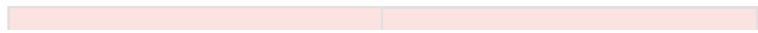

# [World] [Tank War] Map Document

HỆ THỐNG THIẾT KẾ MAP

Ngày khởi tạo: 18 - 09 - 2025

Người soạn: $\bullet$ phucth12 (phucth12)

Phiên bản mới nhất: v1.0

<table><tr><td rowspan=1 colspan=1>Phienban</td><td rowspan=1 colspan=1>Ngay</td><td rowspan=1 colspan=1>Mota</td><td rowspan=1 colspan=1>Nguoi viet</td><td rowspan=1 colspan=1>Nguoireview</td><td rowspan=1 colspan=1>Duyét?</td></tr><tr><td rowspan=1 colspan=1>v1.0</td><td rowspan=1 colspan=1>19-09-2025</td><td rowspan=1 colspan=1>Rework vä chia file goc thanh triet ly thiet ké map(国[World] [Tank War] Map DesignDocument - Original） va thöng tin liéet kévät thé dugc su dung trong map</td><td rowspan=1 colspan=1>Pphucth12</td><td rowspan=1 colspan=1></td><td rowspan=1 colspan=1>□</td></tr></table>

# 1. Mục đích thiết kế.

Tài liệu này là hướng dẫn thiết kế map. Tài liệu mô tả và phân loại các đối tượng quan trọng sẽ áp dụng trong các map.

# 2. Mục tiêu tài liệu.

Tài liệu được dùng để lưu trữ thông tin các assets được sử dụng trong map của game.

3. Mục lục

4. Danh sách vật thể 4.1 Vật thể Block Object (BO) 4.1.1 BO_Building 4.1.2 BO_Collider 4.1.3 BO_Container 4.1.4 BO_Mountain 4.1.5 BO_Rock 4.1.6 BO_Sign 4.2 Vật thể Breakable Object (BR) 4.2.1 BR_Barrel 4.2.2 BR_Cactus 4.2.3 BR_Deco 4.2.4 BR_Gate 4.3 Vật thể Decorations (DE) 4.3.1 DE_Deco 4.4 Vật thể Ground (GR) 4.4.1 GR_Ground 4.5 Vật thể Hiding (HI)

# 4. Danh sách vật thể

# 4.1 Vật thể Block Object (BO)

Các vật thể này có đặc điểm:

◦ Player không thể đi xuyên qua BO.   
◦ Player không có tương tác đặc biệt với BO.   
◦ Đạn bắn từ bất kỳ nguồn nào không thể đi xuyên qua BO (trừ khi có đạn được thiết kế với chủ đích ngược lại với đặc điểm này).

Note: Trong các folders chứa cái tệp file này sẽ được kí hiệu BO_ \*Tên tương ứng\*

# 4.1.1 BO_Building

<table><tr><td rowspan=1 colspan=1>Ten</td><td rowspan=1 colspan=1>Thetich(Dai x Cao x Róng)</td></tr><tr><td rowspan=1 colspan=1>BO_House_01</td><td rowspan=1 colspan=1>4x5×4</td></tr><tr><td rowspan=1 colspan=1>BO_House_02</td><td rowspan=1 colspan=1>30 × 18x 13</td></tr><tr><td rowspan=1 colspan=1>BO_House_03_4x4x4</td><td rowspan=1 colspan=1>4x4x4</td></tr><tr><td rowspan=1 colspan=1>BO_House_04_6x6x6</td><td rowspan=1 colspan=1>6x6x6</td></tr><tr><td rowspan=1 colspan=1>BO_VanCar_01_3x2x2</td><td rowspan=1 colspan=1>3x2x2</td></tr><tr><td rowspan=1 colspan=1>BO_Workbench_01</td><td rowspan=1 colspan=1>2x2x2</td></tr></table>

# 4.1.2 BO_Collider

Note: Obj này được dùng làm biên giới map

<table><tr><td>Ten</td><td>Thé tich (Dai x Cao x Róng)</td></tr><tr><td>Box_1x1x1</td><td>1×5x1</td></tr></table>

# 4.1.3 BO_Container

Note: Các objs sau đều có bản Variant, bản này sẽ đảo ngược dài và rộng của obj gốc.

Note: Điểm khác nhau giữa cái container là màu của nó.

<table><tr><td rowspan=1 colspan=1>Ten</td><td rowspan=1 colspan=1>Thé tich(Däi x Cao x Róng)</td></tr><tr><td rowspan=1 colspan=1>BO_Container_01</td><td rowspan=1 colspan=1>7x4x3</td></tr><tr><td rowspan=1 colspan=1>BO_Container_02</td><td rowspan=1 colspan=1>7x4x3</td></tr><tr><td rowspan=1 colspan=1>BO_Container_03</td><td rowspan=1 colspan=1>7x4x3</td></tr><tr><td rowspan=1 colspan=1>BO_Container_04</td><td rowspan=1 colspan=1>7×4x3</td></tr></table>

# 4.1.4 BO_Mountain

<table><tr><td rowspan=1 colspan=1>Tén</td><td rowspan=1 colspan=1>Thétich(Däi x Cao x Róng)</td></tr><tr><td rowspan=1 colspan=1>BO_CaveGate_01</td><td rowspan=1 colspan=1>12x8x7</td></tr><tr><td rowspan=1 colspan=1>BO_CaveRoof_02</td><td rowspan=1 colspan=1>36×14x42</td></tr><tr><td rowspan=1 colspan=1>BO_Mountain_03</td><td rowspan=1 colspan=1>200×13 x 200</td></tr></table>

# 4.1.5 BO_Rock

<table><tr><td colspan="1" rowspan="1">Tén</td><td colspan="1" rowspan="1">The tich(Dai x Cao x Rong)</td></tr><tr><td colspan="1" rowspan="1">BO_Rock_1x2x1</td><td colspan="1" rowspan="1">1x2x1</td></tr><tr><td colspan="1" rowspan="1">BO_Rock_1x3x4</td><td colspan="1" rowspan="1">1x3x4</td></tr><tr><td colspan="1" rowspan="1">BO_Rock_2x2x2</td><td colspan="1" rowspan="1">2x2x2</td></tr><tr><td colspan="1" rowspan="1">BO_Rock_2x3x2</td><td colspan="1" rowspan="1">2x3x2</td></tr><tr><td colspan="1" rowspan="1">BO_Rock_2x3x4</td><td colspan="1" rowspan="1">2x3x4</td></tr><tr><td colspan="1" rowspan="1">BO_Rock_3x3x2</td><td colspan="1" rowspan="1">3x3x2</td></tr><tr><td colspan="1" rowspan="1">BO_Rock_3x6x5</td><td colspan="1" rowspan="1">3x6x5</td></tr><tr><td colspan="1" rowspan="1">BO_Rock_4x3x1</td><td colspan="1" rowspan="1">4x3x1</td></tr><tr><td colspan="1" rowspan="1">BO_Rock_4x3x2</td><td colspan="1" rowspan="1">4x3x2</td></tr><tr><td colspan="1" rowspan="1">BO_Rock_4x3x3</td><td colspan="1" rowspan="1">4x3x3</td></tr><tr><td colspan="1" rowspan="1">BO_Rock_4x5x5</td><td colspan="1" rowspan="1">4×5x5</td></tr><tr><td colspan="1" rowspan="1">BO_Rock_4x6x4</td><td colspan="1" rowspan="1">4x6x4</td></tr><tr><td colspan="1" rowspan="1">BO_Rock_5x5x4</td><td colspan="1" rowspan="1">5x5×4</td></tr><tr><td colspan="1" rowspan="1"></td><td colspan="1" rowspan="1"></td></tr><tr><td>BO_Rock_5x6x3</td><td>5x6x3</td></tr></table>

# 4.1.6 BO_Sign

<table><tr><td rowspan=1 colspan=1>Tén</td><td rowspan=1 colspan=1>Thétich(Dai x Cao x Róng)</td></tr><tr><td rowspan=1 colspan=1>BO_Signage_01</td><td rowspan=1 colspan=1>0.9 x3 x 1.3</td></tr><tr><td rowspan=1 colspan=1>BO_Signage_02</td><td rowspan=1 colspan=1>0.1x 2.8×1</td></tr></table>

# 4.2 Vật thể Breakable Object (BR)

Các vật thể này có đặc điểm:

◦ Player không thể đi xuyên qua BR.   
◦ Player không có tương tác đặc biệt với BR.   
◦ Đạn bắn từ bất kỳ nguồn nào đều phá được BR (trừ khi có đạn được thiết kế với chủ đích ngược lại với đặc điểm này).

Note: Trong các folders chứa cái tệp file này sẽ được kí hiệu BR_ \*Tên tương ứng\*

# 4.2.1 BR_Barrel

<table><tr><td colspan="1" rowspan="1">Tén</td><td colspan="1" rowspan="1">Thé tich(Dai x Cao x Róng)</td><td colspan="1" rowspan="1">HP</td></tr><tr><td colspan="1" rowspan="1">BR_Box_01_2x2x2</td><td colspan="1" rowspan="1">2x2x2</td><td colspan="1" rowspan="1">1</td></tr><tr><td colspan="1" rowspan="1">BR_Box_02_2x2x2</td><td colspan="1" rowspan="1">2x2x2</td><td colspan="1" rowspan="1">1</td></tr><tr><td colspan="1" rowspan="1">BR_ToxicBarrel_01</td><td colspan="1" rowspan="1">1x1×1</td><td colspan="1" rowspan="1">1</td></tr><tr><td colspan="1" rowspan="1">BR_ToxicBarrel_02_2x3x3</td><td colspan="1" rowspan="1">2x3x3</td><td colspan="1" rowspan="1">1</td></tr><tr><td colspan="1" rowspan="1">BR_ToxicBarrel_02_3x3x2</td><td colspan="1" rowspan="1">3x3x2</td><td colspan="1" rowspan="1">1</td></tr><tr><td colspan="1" rowspan="1">BR_ToxicBarrel_03</td><td colspan="1" rowspan="1">1 × 1.6 × 1</td><td colspan="1" rowspan="1">1</td></tr><tr><td colspan="1" rowspan="1"></td><td colspan="1" rowspan="1"></td><td colspan="1" rowspan="1"></td></tr><tr><td>BR_ToxicBarrel_04</td><td>1 x 2.2 ×1</td><td>1</td></tr></table>

# 4.2.2 BR_Cactus

<table><tr><td rowspan=1 colspan=1>Ten</td><td rowspan=1 colspan=1>Thé tich(Däi x Cao x Róng)</td><td rowspan=1 colspan=1>HP</td></tr><tr><td rowspan=1 colspan=1>BR_Cactus_1x0.5x1</td><td rowspan=1 colspan=1>1 x 0.5×1</td><td rowspan=1 colspan=1>1</td></tr><tr><td rowspan=1 colspan=1>BR_Cactus_1x1x1</td><td rowspan=1 colspan=1>1x1×1</td><td rowspan=1 colspan=1>1</td></tr><tr><td rowspan=1 colspan=1>BR_Cactus_1x2x1</td><td rowspan=1 colspan=1>1x2x1</td><td rowspan=1 colspan=1>1</td></tr><tr><td rowspan=1 colspan=1>BR_Cactus_1x3x1</td><td rowspan=1 colspan=1>1x3x1</td><td rowspan=1 colspan=1>1</td></tr><tr><td rowspan=1 colspan=1>BR_Cactus_2x2x1</td><td rowspan=1 colspan=1>2x2x1</td><td rowspan=1 colspan=1>1</td></tr></table>

# 4.2.3 BR_Deco

<table><tr><td rowspan=1 colspan=1>Tén</td><td rowspan=1 colspan=1>The tich(Dai x Cao x Róng)</td><td rowspan=1 colspan=1>HP</td></tr><tr><td rowspan=1 colspan=1>BR_Skull_01</td><td rowspan=1 colspan=1>1 x 0.6 x 1.9</td><td rowspan=1 colspan=1>1</td></tr></table>

# 4.2.4 BR_Gate

<table><tr><td rowspan=1 colspan=1>Tén</td><td rowspan=1 colspan=1>Thé tich(Dai x Cao x Róng)</td><td rowspan=1 colspan=1>HP</td></tr><tr><td rowspan=1 colspan=1>BR_Gate_4x2.5x1</td><td rowspan=1 colspan=1>4 x 2.5 x 1</td><td rowspan=1 colspan=1>1</td></tr><tr><td rowspan=1 colspan=1>BR_Gate_7x2.5x1</td><td rowspan=1 colspan=1>7 × 2.5 x 1</td><td rowspan=1 colspan=1>1</td></tr></table>

# 4.3 Vật thể Decorations (DE)

Các vật thể này có đặc điểm:

◦ Player đi xuyên qua được DE.   
◦ Player không có tương tác đặc biệt với DE.   
◦ Nhỏ đủ để không phá thế giới quan người chơi $( < = 5 \times 0 . 5 \times 5 )$ .

Note: Trong các folders chứa cái tệp file này sẽ được kí hiệu DE_ \*Tên tương ứng\*

# 4.3.1 DE_Deco

<table><tr><td colspan="1" rowspan="1">Tén</td><td colspan="1" rowspan="1">The tich(Däi x Cao x Rong)</td></tr><tr><td colspan="1" rowspan="1">DE_DrainCover_01</td><td colspan="1" rowspan="1">1x 0.07 x0.7</td></tr><tr><td colspan="1" rowspan="1">DE_Grass_01_Green</td><td colspan="1" rowspan="1">0.4 x 0.3 x 0.4</td></tr><tr><td colspan="1" rowspan="1">DE_Grass_02_Green</td><td colspan="1" rowspan="1">0.6 x 0.37 x 0.6</td></tr><tr><td colspan="1" rowspan="1">DE_Railway_01</td><td colspan="1" rowspan="1">1.4 x 0.1 x 2.8</td></tr><tr><td colspan="1" rowspan="1">DE_Railway_02</td><td colspan="1" rowspan="1">2.1 x 0.1× 2.1</td></tr><tr><td colspan="1" rowspan="1">DE_Railway_03</td><td colspan="1" rowspan="1">1.4 x 0.1 x 2.8</td></tr><tr><td colspan="1" rowspan="1">DE_Stone_01_Gray</td><td colspan="1" rowspan="1">0.3 x 0.06 x 0.4</td></tr><tr><td colspan="1" rowspan="1">DE_Stone_01_Sand</td><td colspan="1" rowspan="1">0.7 x0.03 x 0.7</td></tr><tr><td colspan="1" rowspan="1">DE_Stone_01_SandDark</td><td colspan="1" rowspan="1">0.7 ×0.03 x 0.7</td></tr><tr><td colspan="1" rowspan="1">DE_Stone_02_Gray</td><td colspan="1" rowspan="1">0.7 ×0.1 x 0.6</td></tr><tr><td colspan="1" rowspan="1">DE_Stone_02_Sand</td><td colspan="1" rowspan="1">1.2 x 0.03 x 0.7</td></tr><tr><td colspan="1" rowspan="1">DE_Stone_02_SandDark</td><td colspan="1" rowspan="1">1.2 × 0.03 x 0.7</td></tr><tr><td colspan="1" rowspan="1">DE_Stone_03_Gray</td><td colspan="1" rowspan="1">0.7 ×0.1 x0.6</td></tr><tr><td colspan="1" rowspan="1">DE_Stone_03_Sand</td><td colspan="1" rowspan="1">1.3 x 0.03 x 1.1</td></tr><tr><td colspan="1" rowspan="1">DE_Stone_03_SandDark</td><td colspan="1" rowspan="1">1.3 x 0.03 x 1.1</td></tr><tr><td colspan="1" rowspan="1">DE_Stone_04_Sand</td><td colspan="1" rowspan="1">1.4 x 0.03 x 1.2</td></tr><tr><td colspan="1" rowspan="1">DE_Stone_04_SandDark</td><td colspan="1" rowspan="1">1.3 x 0.03 x 1.1</td></tr><tr><td colspan="1" rowspan="1"></td><td colspan="1" rowspan="1"></td></tr><tr><td colspan="1" rowspan="1">DE_Stone_05_Sand</td><td colspan="1" rowspan="1">2 x 0.05 x 1.5</td></tr><tr><td colspan="1" rowspan="1">DE_Stone_05_SandDark</td><td colspan="1" rowspan="1">2 x 0.05 x 1.5</td></tr><tr><td colspan="1" rowspan="1">DE_StoneGrass_01_Green</td><td colspan="1" rowspan="1">0.4 x 0.2 x 0.6</td></tr><tr><td colspan="1" rowspan="1">DE_StoneGrass_02_Green</td><td colspan="1" rowspan="1">0.7 x 0.3 x 0.8</td></tr></table>

# 4.4 Vật thể Ground (GR)

Các vật thể này có đặc điểm:

Player không thể đi xuyên qua GR. ◦ Player không có tương tác đặc biệt với GR. ◦ Sàn chơi. ◦ Mặt phẳng (Không có độ cao).

Note: Trong các folders chứa cái tệp file này sẽ được kí hiệu GR_ \*Tên tương ứng\*

# 4.4.1 GR_Ground

<table><tr><td rowspan=1 colspan=1>Tén</td><td rowspan=1 colspan=1> Dién tich (Dai x Róng)</td></tr><tr><td rowspan=1 colspan=1>GR_Grass_01</td><td rowspan=1 colspan=1>102 x 93</td></tr><tr><td rowspan=1 colspan=1>GR_Sand_01</td><td rowspan=1 colspan=1>100×100</td></tr></table>

# 4.5 Vật thể Hiding (HI)

Các vật thể này có đặc điểm:

Player và đạn ở bất kỳ nguồn nào đều đi xuyên qua được HI.   
◦ Player sẽ tàng hình khi đi vào HI.   
◦ HI không thể bị phá huỷ.   
◦ Tham khảo thông tin của vật thể: [World] [Tank War] Grass Logic Design

Note: Trong các folders chứa cái tệp file này sẽ được kí hiệu HI_ \*Tên tương ứng\*

# 4.5.1 HI_Grass

<table><tr><td rowspan=1 colspan=1>Ten</td><td rowspan=1 colspan=1>Thétich(Dai x Cao x Róng)</td></tr><tr><td rowspan=1 colspan=1>HI_Grass_1x1x1</td><td rowspan=1 colspan=1>1x1x1</td></tr><tr><td rowspan=1 colspan=1>HI_Grass_2x1x2</td><td rowspan=1 colspan=1>2x1x2</td></tr></table>

# 4.6 Vật thể Outpost (OP) (Chế độ Outpost Breaker)

Các vật thể này có đặc điểm:

◦ Player không thể đi xuyên qua OP.   
◦ Player không có tương tác đặc biệt với OP.   
◦ Đạn bắn từ bất kỳ nguồn nào không thể đi xuyên qua OP (trừ khi có đạn được thiết kế với chủ đích ngược lại với đặc điểm này).   
◦ Đạn tank team ATK có khả năng bắn phá OP.   
◦ Tham khảo thông tin của vật thể: [Combat Module] [Tank War] Outpost Design - Base Capture Mode

Note: Trong các folders chứa cái tệp file này sẽ được kí hiệu OP_ \*Tên tương ứng\*

# 4.6.1 OP_Tower

<table><tr><td>Tén</td><td>Thétich (Dai x Cao x Róng)</td></tr><tr><td>OP_Tower_01_6x7x6</td><td>6x7x6</td></tr></table>

# 4.7 Vật thể Tank (TA)

Các vật thể này có đặc điểm:

TA không thể đi xuyên qua nhau.   
TA không có tương tác đặc biệt với nhau.   
▪ Đạn bắn từ bất kỳ nguồn nào không thể đi xuyên qua TA (trừ khi có đạn được thiết kế với chủ đích ngược lại với đặc điểm này).   
▪ Đạn từ TA thuộc team khác nhau có khả năng bắn phá nhau.   
▪ Size TA của các class khác nhau, scale theo: Scout < Assault < Heavy   
▪ Tham khảo thông tin của vật thể: [Character Module] [Tank War] Tank System Detail

Note: Các con tank đều nằm trong _GameAssets/Models/TankWars_Models/Char

# 4.7.1 Class Scout

<table><tr><td rowspan=1 colspan=1>Tén</td><td rowspan=1 colspan=1>Thé tich(Dai x Cao x Róng)</td></tr><tr><td rowspan=1 colspan=1>TA_Scout_01</td><td rowspan=1 colspan=1>2 x 1.8 x 2</td></tr><tr><td rowspan=1 colspan=1>TA_Scout_02</td><td rowspan=1 colspan=1>2x 1.8x2</td></tr></table>

# 4.7.2 Class Assault

<table><tr><td rowspan=1 colspan=1>Ten</td><td rowspan=1 colspan=1>Thé tich(Dai x Cao x Róng)</td></tr><tr><td rowspan=1 colspan=1>TA_Assault_01</td><td rowspan=1 colspan=1>2 x 2 x 2.5</td></tr><tr><td rowspan=1 colspan=1>TA_Assault_02</td><td rowspan=1 colspan=1>2.3 x 2.3 x 3.3</td></tr></table>

# 4.7.3 Class Heavy

<table><tr><td rowspan=1 colspan=1>Tén</td><td rowspan=1 colspan=1>Thé tich(Dai x Cao x Róng)</td></tr><tr><td rowspan=1 colspan=1>TA_Heavy_01</td><td rowspan=1 colspan=1>3 x 2.7 x3</td></tr><tr><td rowspan=1 colspan=1>TA_Heavy_02</td><td rowspan=1 colspan=1>3.5 x 3 x 3.9</td></tr></table>

# 5. Danh sách map

# 5.1 Mode Outpost Breaker

<table><tr><td rowspan=1 colspan=1>Tén</td><td rowspan=1 colspan=1>Tén (Scene)</td><td rowspan=1 colspan=1>Thé tich(Dai x Cao x Róng)</td></tr><tr><td rowspan=1 colspan=1>Desert</td><td rowspan=1 colspan=1>TankGamePlay-Final</td><td rowspan=1 colspan=1>100 x 100</td></tr></table>

# 5.2 Mode Deathmatch

<table><tr><td>Tén</td><td>Tén (Scene)</td><td>Thé tich (Dai x Cao x Róng)</td></tr><tr><td>Desert(?)</td><td></td><td>100 x 100</td></tr></table>

# 6. Notes

• Kích thước đối tượng được đo bằng đơn vị mặc định trong Unity (Unit):

◦ 1 mét $\mathbf { \lambda } = \mathbf { 1 }$ Unit trong Unity

• Đối tượng nhỏ nhất sẽ luôn là DE.

Note: Tên map sẽ được cập nhật